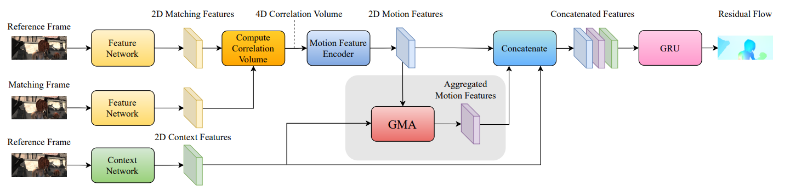
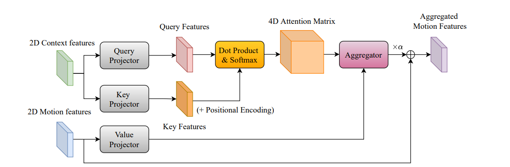

**日期**: 2021年10月11日 星期一      **姓名**: 陈勇虎 

**Plan:**

- [ ] 阅读论文《Learning to Estimate Hidden Motions with Global Motion Aggregation》[1]

**Do**:

- [ ] 阅读论文《Learning to Estimate Hidden Motions with Global Motion Aggregation》

**Check**:

- [ ] GMA是基于RAFT框架提出的模型，编码器端采用和RAFT一致的残差网络来实现。文章提出了使用Transformer来获取帧内的self-similarity。

  
  
  与传统的Transformer不一致的地方在于，如下所示。Q，K矩阵来自提取的2D上下文特征，而V矩阵来自提取的运动特征。因此这里的attention并不算是传统的self-attention。
  
  

**Action**:

- [ ] 继续调研光流法动态感知领域的应用算法和光流估计算法
- [ ] 阅读和学习论文源码
- [ ] 调研和收集Transformer的应用
- [ ] 调研和收集处理occlusion问题的解决方案

**Reference:**

1. Jiang, Shihao, Dylan Campbell, Yao Lu, Hongdong Li, and Richard Hartley. 2021. “Learning to Estimate Hidden Motions with Global Motion Aggregation.” *ArXiv:2104.02409 [Cs]*, July. http://arxiv.org/abs/2104.02409.

