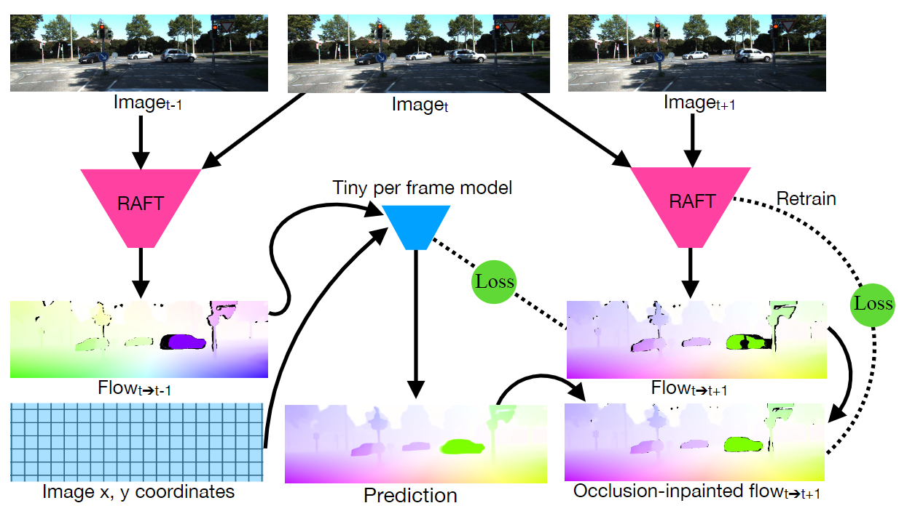

**日期**: 2021年10月13日 星期三      **姓名**: 陈勇虎 

**Plan:**

- [ ] 阅读论文《SMURF: Self-Teaching Multi-Frame Unsupervised RAFT With Full-Image Warping》[1]

**Do**:

- [ ] 了解SMURF的框架思想

**Check**:

- [ ] SMURF的训练只在最终阶段部分使用多帧的方式，同时也只在训练中使用多帧，在推理阶段不使用多帧。

- [ ] 多帧的框架结构如下图所示，通过 **RAFT** 求解出反向光流 $f_{t\rightarrow t-1}$,然后通过得到的 $f_{t \rightarrow t-1}$再去预测一次正向光流 $f_{t \rightarrow t + 1}$，若在 $t + 1$发生了 occlusion，而 $t$ 和 $t - 1$， 均没有发生occlusion，那么$f_{t \rightarrow t - 1}$将必然含有被遮挡物体的信息，从而可以去精化之前的估计结果。

  

**Action**:

- [ ] 继续调研光流法动态感知领域的应用算法和光流估计算法
- [ ] 阅读和学习论文源码
- [ ] 调研和收集Transformer的应用
- [ ] 调研和收集处理occlusion问题的解决方案

**Reference:**

- [ ] Stone, Austin, Daniel Maurer, Alper Ayvaci, Anelia Angelova, and Rico Jonschkowski. n.d. “SMURF: Self-Teaching Multi-Frame Unsupervised RAFT With Full-Image Warping,” 10.
