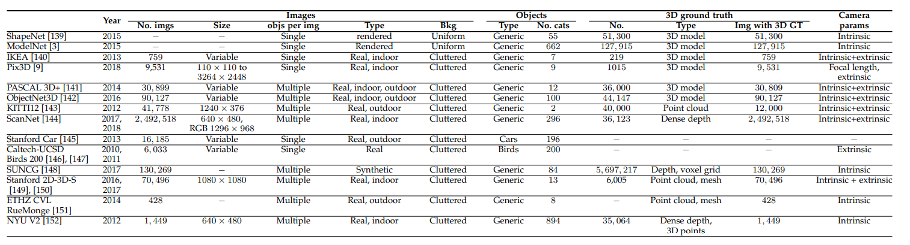

**日期**: 2021年10月14日 星期四      **姓名**: 陈勇虎 

**Plan:**

- [ ] 阅读论文《Single image 3D object reconstruction based on deep learning: A review》[1]

**Do**:

- [ ] 阅读论文《Single image 3D object reconstruction based on deep learning: A review》
- [ ] 阅读&学习FlowNet2和GMA中datasets处理KITTI数据的源码
- [ ] 处理FlyingThings3D数据集

**Check**:

- [ ] 整理处理KITTI数据的源码

- [ ] 阅读论文

  深度学习领域下的3D重建模型所使用的数据集统计如下所示。

  

- [ ]  学习 **FlowAugmentor** 和 **SparseFlowAgumentor** 的实现方式。

**Action**:

- [ ] 继续调研光流法动态感知领域的应用算法和光流估计算法
- [ ] 阅读和学习论文源码
- [ ] 调研和收集Transformer的应用
- [ ] 调研和收集处理occlusion问题的解决方案
