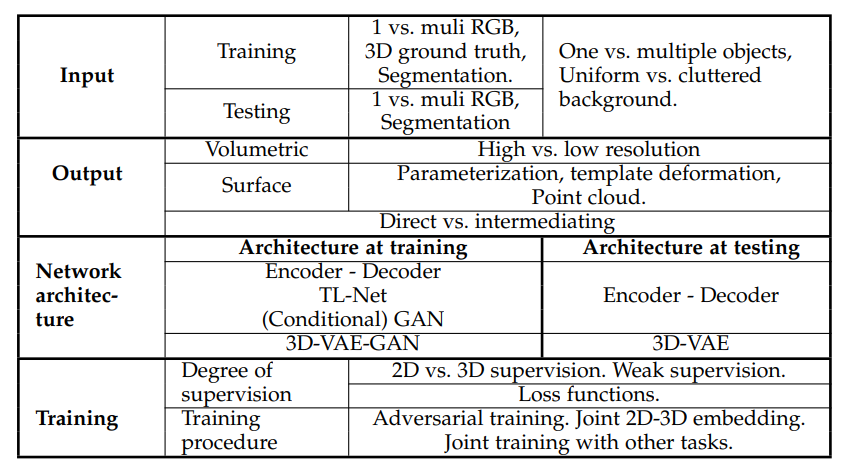

**日期**: 2021年10月15日 星期五      **姓名**: 陈勇虎 

**Plan:**

- [ ] 阅读《Image-based 3D Object Reconstruction: State-of-the-Art and Trends in the Deep Learning Era》

**Do**:

- [ ] 阅读《Image-based 3D Object Reconstruction: State-of-the-Art and Trends in the Deep Learning Era》
- [ ] 学习GMA的extractor模块

**Check**:

- [ ] 《Image-based 3D Object Reconstruction: State-of-the-Art and Trends in the Deep Learning Era》

  深度学习的方法下基于图像的SOTA重建方法分类。

  

- [ ] 整理数据集datasets.py的实现

- [ ] 学习 **FlowAugmentor** 和 **SparseFlowAgumentor** 的实现方式

**Action**:

- [ ] 继续调研光流法动态感知领域的应用算法和光流估计算法
- [ ] 阅读和学习论文源码
- [ ] 调研和收集Transformer的应用
- [ ] 调研和收集处理occlusion问题的解决方案
