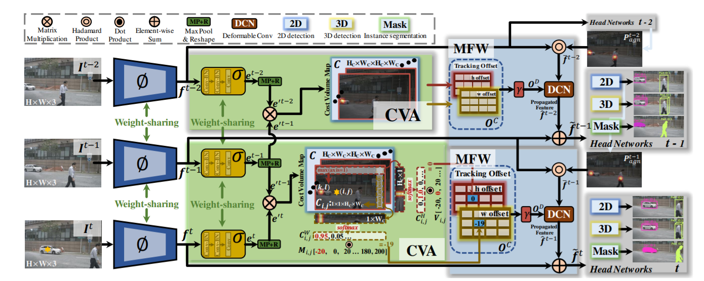

**日期**: 2021年10月18日 星期一      **姓名**: 陈勇虎 

**Plan:**

- [ ] 项目调研
- [ ] 训练GMA，测试其在FlyingChairs数据集上的性能

**Do**:

- [ ] 项目调研
- [ ] 训练GMA，测试其在FlyingChairs数据集上的性能

**Check**:

- [ ] 项目调研

  大多数现有的online MOT方法的检测部分在整个网络中都是独立进行的，即没有任何输入来自跟踪任务。事实上，不仅仅检测可以为跟踪服务，跟踪其实也可以反过来辅助检测任务，因此在这篇文章中作者提出了一种新的联合检测和跟踪端到端模型，名为TraDeS（Track to Detect and Segment），它能利用跟踪线索来辅助检测。TraDeS通过cost volume来推断目标跟踪偏移量，该cost volume用于传播前帧的目标特征，以改善当前目标的检测和分割。在MOT、nuScenes、MOTS和Youtube-VIS数据集上，TraDeS均显示不错的有效性和优越性。	

  

- [ ] 训练后测试其EPE为0.943，比其提供的0.79模型不太一致

**Action**:

- [ ] 继续调研光流法动态感知领域的应用算法和光流估计算法
- [ ] 阅读和学习论文源码
- [ ] 调研和收集Transformer的应用
- [ ] 调研和收集处理occlusion问题的解决方案
