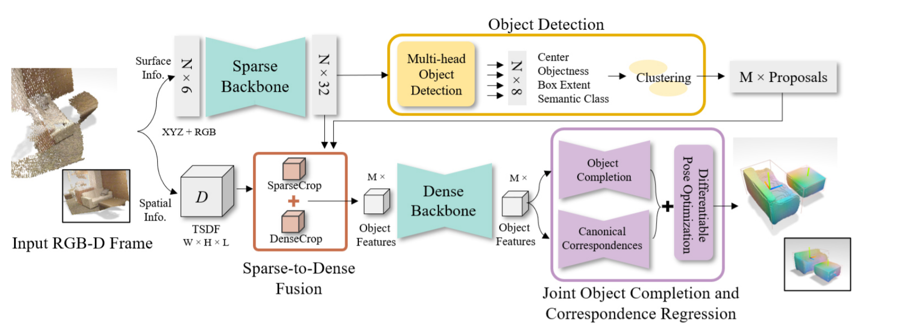

**日期**: 2021年10月19日 星期二      **姓名**: 陈勇虎 

**Plan:**

- [ ] 项目调研和整理
- [ ] 调试STaRFlow

**Do**:

- [ ] 项目调研和整理
- [ ] 调试STaRFlow

**Check**:

- [ ] 项目调研和整理
- [ ] 《Seeing Behind Objects for 3D Multi-Object Tracking in RGB-D Sequences》

	

  ​		为了在完整的RGB-D序列上实现多目标跟踪，基于摄像机空间中的位置和标准对应关系，跨时间步关联目标proposals。每个检测到的目标都有一个预测的 bounding box 和标准目标重建(canonical object reconstruction)，通过将预测目标几何中的密集对应映射到标准空间，用一个 $64^3$ 网格表示。为了随着时间的推移将检测融合到tracklets中，以一帧一帧的方式 (frame-by-frame fashion) 构建关联; 我们从第一帧中每个检测到的物体的初始tracklets $T^{i}$开始。

  ​		然后，对于每一帧，基于它们的bounding box的3D IoU计算当前tracklets $T^i$和传入的proposals $D^j$ 之间的成对距离(pairwise distance)。使用了匈牙利算法来寻找proposals对tracklets的最优分配，并拒绝任何3D IoU低于0.3的匹配。任何没有匹配的新物体检测都会形成额外的新tracklets。然后，tracklet的规范对象重建被更新为该tracklet中每个对象检测的规范重建的移动平均值; 在所有实验中使用4:1加权来计算移动平均值。在按帧的顺序计算tracklets及其规范重构结果后, 去匹配那象可能与贪心的处理流程中不匹配的对象。对于所有tracklets和所有未分配的proposals，使用标准表示的三维体积IoU计算成对距离(在阈值0.5进行二值化)。我们再次计算最优分配并拒绝匹配，如果掩码IoU小于0.3的话。

- [ ] 调试STaRFlow运行FlyingChairsOcc数据集，等待测试的EPE结果。

**Action**:

- [ ] 继续调研光流法动态感知领域的应用算法和光流估计算法
- [ ] 阅读和学习论文源码
- [ ] 调研和收集Transformer的应用
- [ ] 调研和收集处理occlusion问题的解决方案
