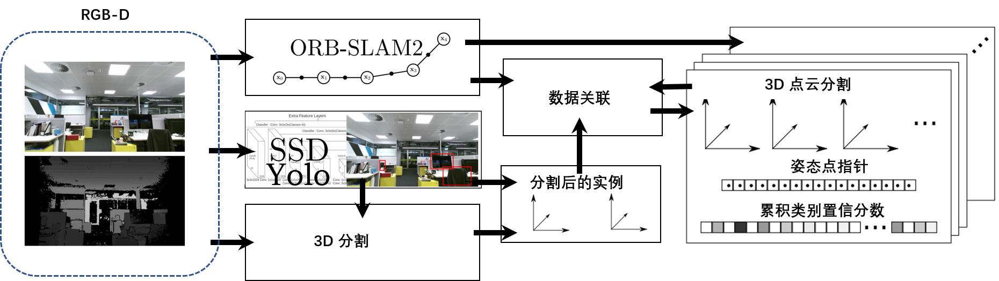

**日期**: 2021年10月20日 星期三      **姓名**: 陈勇虎 

**Plan:**

- [ ] 项目调研和整理方案

**Do**:

- [ ] 项目调研和整理方案

**Check**:

- [ ] 项目调研和整理方案

  ​		使用的带有语义信息的场景三维地区构建算法基于ORB-SLAM2进行相机姿态的估计，同时采用SSD，Yolo等模块进行目标检测和后续的3D分割，最后根据分割的语义实例构建语义地图。采用了自适应的3D无监督方法为Yolo检测出的对象分配一个3D点云段，通过数据关联决定是否在地图中创建一个对象，或者与已有的对象进行关联。在后一种情况中，会利用新检测到的三维结构对语义地图的三维模型进行扩展。每个对象在过程中将会保存其3D点云段，ORB_SLAM位姿指针，和每个类别的置信度分数，每当有新的帧传入，即产生新的观测数据时，以上数据都会实时进行更新。项目结构如下图所示。

  

- [ ] STaRFlow训练了7轮，EPE为2.561

**Action**:

- [ ] 继续调研光流法动态感知领域的应用算法和光流估计算法
- [ ] 阅读和学习论文源码
- [ ] 调研和收集Transformer的应用
- [ ] 调研和收集处理occlusion问题的解决方案
