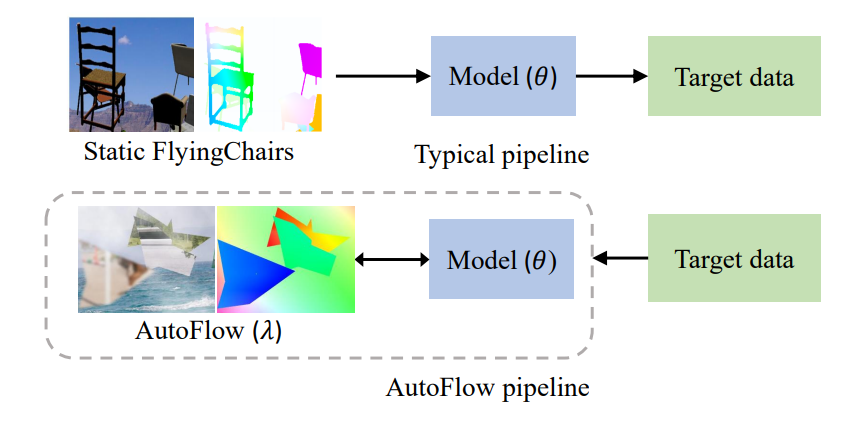
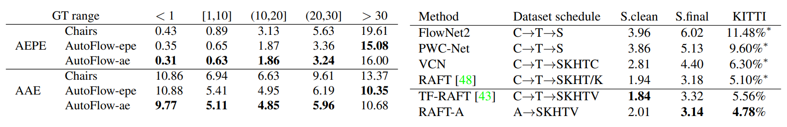

**日期**: 2021年10月21日 星期四      **姓名**: 陈勇虎 

**Plan:**

- [ ] 阅读论文《AutoFlow: Learning a Better Training Set for Optical Flow》[1]

**Do**:

- [ ] 阅读论文《AutoFlow: Learning a Better Training Set for Optical Flow》

**Check**:

- [ ] 阅读论文《AutoFlow: Learning a Better Training Set for Optical Flow》

  

  文章通过模型学习人造数据集的特点，根据目标数据集生成“更适合训练”的人造数据集，并进而在新的数据集上去训练模型，通过实验发现，新数据在Sintel等数据集方面可以让部分模型的精度超过原来人造数据集上的SOTA模型。从下表可以得到启示，可以考虑用新的数据集扩充原始的人造数据集，完成模型的微调。

  

**Action**:

- [ ] 继续调研光流法动态感知领域的应用算法和光流估计算法
- [ ] 阅读和学习论文源码
- [ ] 调研和收集Transformer的应用
- [ ] 调研和收集处理occlusion问题的解决方案

**Reference**

- [ ] Sun, Deqing, Daniel Vlasic, Charles Herrmann, Varun Jampani, Michael Krainin, Huiwen Chang, Ramin Zabih, William T. Freeman, and Ce Liu. 2021. “AutoFlow: Learning a Better Training Set for Optical Flow.” *ArXiv:2104.14544 [Cs]*, April. http://arxiv.org/abs/2104.14544.
