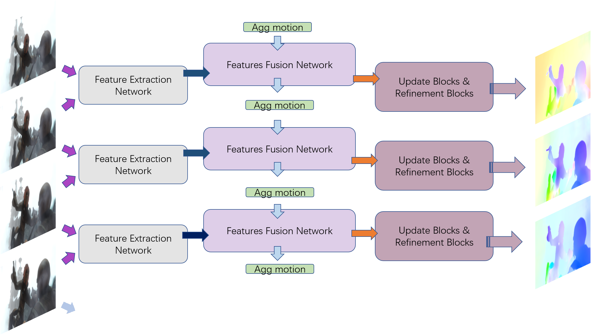
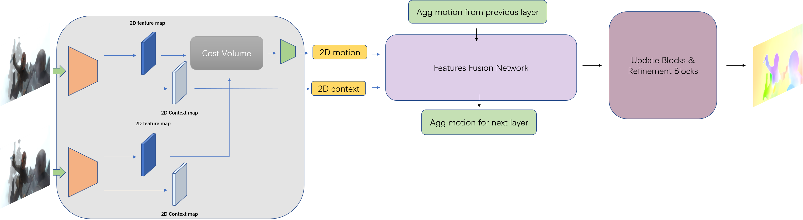
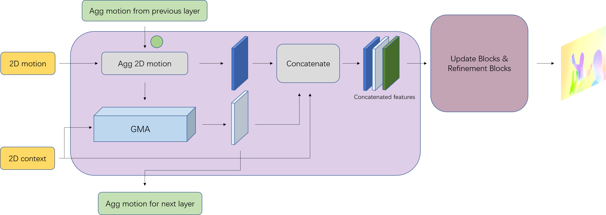

**日期**: 2021年10月22日 星期五      **姓名**: 陈勇虎 

**Plan:**

- [ ] 绘制网络结构

**Do**:

- [ ] 绘制网络结构

**Check**:

- [ ] 绘制网络结构
- [ ] 整体框架
	
- [ ] 特征提取层
	
- [ ] 特征融合层
	
- [ ] 迭代更新和精化层，待思考

**Action**:

- [ ] 继续调研光流法动态感知领域的应用算法和光流估计算法
- [ ] 阅读和学习论文源码
- [ ] 调研和收集Transformer的应用
- [ ] 调研和收集处理occlusion问题的解决方案
