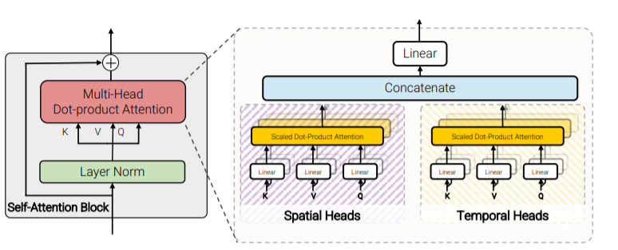

**日期**: 2021年10月25日 星期一      **姓名**: 陈勇虎 

**Plan:**

- [ ] 阅读论文《ViViT: A Video Vision Transformer》[1]

**Do**:

- [ ] 阅读论文《ViViT: A Video Vision Transformer》

**Check**:

- [ ] 论文《ViViT: A Video Vision Transformer》

* 利用Transformer解决视频的问题，是ViT在视频输入上的应用

- 视频的输入是图像输入的数多倍，Transformer的性能和输入token之间是平方关系，处理性能是一个很大的问题

- 探究了视频数据在ViT上的优化，再进一步探究了四种不提供的特征融合提取方式的性能和效果

  讨论了两种直观的输入方式，一种为不同帧之间图像直接按照ViT的处理，转换为tokens，然后按照frames的顺序进行组合，另一种则将多帧直接进行组合，同时获取时间，空间上的一个token，这样能更有效融合时空信息。并提出了以下四个模型结构。

  |  |  |
  | --------------------------------------------------- | --------------------------------------------------- |
  |  |  |

**Action**:

- [ ] 继续调研光流法动态感知领域的应用算法和光流估计算法
- [ ] 阅读和学习论文源码
- [ ] 调研和收集Transformer的应用
- [ ] 调研和收集处理occlusion问题的解决方案

**Reference**

- [ ] Arnab, Anurag, Mostafa Dehghani, Georg Heigold, Chen Sun, Mario Lučić, and Cordelia Schmid. 2021. “ViViT: A Video Vision Transformer.” *ArXiv:2103.15691 [Cs]*, March. http://arxiv.org/abs/2103.15691.
