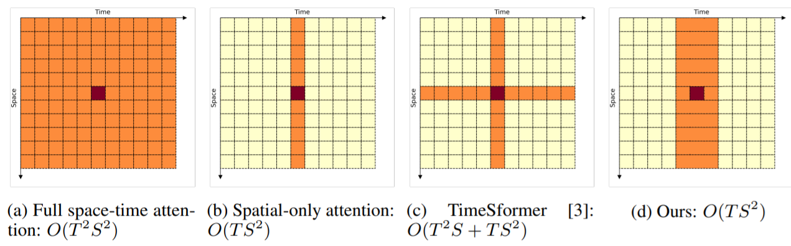
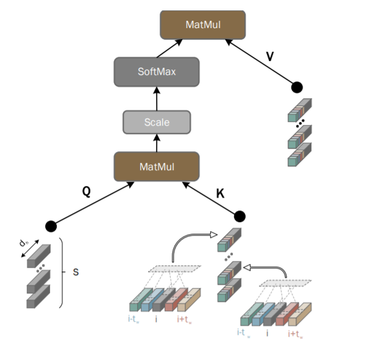

**日期**: 2021年10月27日 星期三      **姓名**: 陈勇虎 

**Plan:**

- [ ] 阅读论文《Space-Time Mixing Attention for Video Transformer》[1]

**Do**:

- [ ] 阅读论文《Space-Time Mixing Attention for Video Transformer》

**Check**:

- [ ] 《Space-Time Mixing Attention for Video Transformer》

  模型对 Video Transformer 中使用的完整时空注意力进行了两个近似：

  * 它将时间注意力限制在局部时间窗口上，并利用 Transformer 的深度来获得视频序列的完整时间覆盖。
  * 它使用有效的时空混合来处理jointly 空间和时间位置，而不会在仅空间注意力模型之上引入任何额外成本。

​	 模型结构:

​		即保留了Space的全部，但是划定了一个时间窗口来做时空的transformer。

**Action**:

- [ ] 继续调研光流法动态感知领域的应用算法和光流估计算法
- [ ] 阅读和学习论文源码
- [ ] 调研和收集Transformer的应用
- [ ] 调研和收集处理occlusion问题的解决方案

**Reference**

- [ ] Bulat, Adrian, Juan-Manuel Perez-Rua, Swathikiran Sudhakaran, Brais Martinez, and Georgios Tzimiropoulos. 2021. “Space-Time Mixing Attention for Video Transformer.” *ArXiv:2106.05968 [Cs]*, June. http://arxiv.org/abs/2106.05968.
