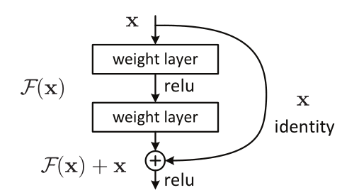

**日期**: 2021年10月28日 星期四      **姓名**: 陈勇虎 

**Plan:**

- [ ] 阅读《Deep Residual Learning for Image Recognition》[1]

**Do**:

- [ ] 阅读《Deep Residual Learning for Image Recognition》

**Check**:

- [ ] 《Deep Residual Learning for Image Recognition》

  

  假设输入为 $x$，有两层全连接层学习到的映射为 $H(x)$，也就是说这两层可以渐进拟合 $H(x)$。假设 $H(x)$ 与 $x$ 维度相同，那么拟合 $H(x)$ 与拟合残差函数 $H(x) - x$ 等价，令残差函数 $F(x) = H(x) - x$ ，则原函数变为 $F(x) + x$ ，于是直接在原网络的基础上加上一个跨层连接，这里的跨层连接也很简单，就是 将 $x$ 的 恒等映射传递过去。
  本质也就是不改变目标函数 $H(x)$，将网络结构拆成两个分支，一个分支是残差映射 $F(x)$，一个分支是恒等映射 $x$，于是网络仅需学习残差映射 $F(x)$ 即可。至于为什么这么做，后面介绍残差结构原理的时候会解释。
  
  整个残差结构可以形式化定义为 $y = F(x,\{W_i\}) + x$，这里的 $F(x,\{W_i\})$  指拟合的残差映射，如上图中有两层全连接层，即 $F=W_2\sigma(W_1x)$ ，其中 $\sigma$ 指 ReLU，注意这里为了简洁没有写上bias。当 $F$ 与 $x$ 维度相同时，可以直接逐元素相加；但如果不同，就必须给 $x$ 再加一个线性映射，将其映射到一个与 $F$ 维度相同的向量，此时整个残差结构为 $y = F(x,\{W_i\}) + W_sx$ ，$W_s$ 就是一个用于维度匹配的矩阵。其实当 $F$ 与 $x$ 维度相同时也可以用一个方阵 $W_s$ ，但经过后面的实验发现恒等映射更好，尤其是在bottleneck结构中。
  
- [ ] 因此，参考ResNet思想及其用法，可以考虑将光流的输出也定义成两个结果之间的差值，而不是直接输出光流结果，同时，分层的特征提取过程也可以使用残差实现。

**Action**:

- [ ] 继续调研光流法动态感知领域的应用算法和光流估计算法
- [ ] 阅读和学习论文源码
- [ ] 调研和收集Transformer的应用
- [ ] 调研和收集处理occlusion问题的解决方案

**Reference**

- [ ] He, Kaiming, Xiangyu Zhang, Shaoqing Ren, and Jian Sun. 2015. “Deep Residual Learning for Image Recognition.” *ArXiv:1512.03385 [Cs]*, December. http://arxiv.org/abs/1512.03385.
