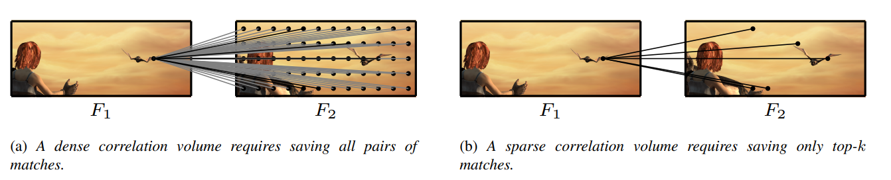
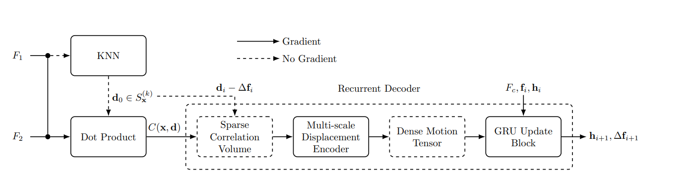

**日期**: 2021年10月29日 星期五      **姓名**: 陈勇虎 

**Plan:**

- [ ] 学习稀疏Correlation Volume处理细节

**Do**:

- [ ] 学习稀疏Correlation Volume处理细节

**Check**:

- [ ] 记 $I_1, I_2: \mathbb{Z}^2 \rightarrow \mathbb{R}^3$ 为两张RGB图像，待解决的问题就是估计稠密的流场 $f:\mathbb{Z}^2\rightarrow\mathbb{R}^2$，映射每个像素x到其位移向量$f(x)$。

  现在的深度学习光流估计方法，首先会对图像对进行特征提取得到图像的feature map $F_1,F_2:\mathbb{Z}^2\rightarrow\mathbb{R}^c$，这里的 $c$ 为通道数，Correlation Volume $C : \mathbb{Z}^4 \rightarrow R$ 由特征向量直接的点积得到。
  $$
  C(x,d)=F_1(x)\cdot F_2(x + d).
  $$
  输出为一个四维的张量，可以表示为集合:
  $$
  \mathcal{C}=\{C(x,d)|x\in \mathcal{X}, d \in \mathcal{D}\}.
  $$
  这里， $\mathcal{X} = [0, h
  ) \times[0, w) \cap \mathbb{Z}^2$ 为 feature map $F_1$ 的域， $|\mathcal{X}| = hw$ ，其中的 $h$, $w$ 分别为 $F_1$的 $height$ 和 $width$。$d$ 为 $x$ 方向或者 $y$  方向上的最大位移量，并且有 $|\mathcal{D}| = (2d+1)^2$，因此，Correlation Volume $\mathcal{C}$ 中含有 $hw(2d+1)^2$的元素。
  
  为了降低Correlation Volume的尺寸，以前的方法使用了由粗到细的策略，然后对有限的d进行warping操作，为了精确处理大位移的问题，RAFT构建了全局的Correlation Volume，当然，位移的范围d受到feature map的大小限制。RAFT的Correlation Volume包含了 $N^2$ 的元素，这里的 $N = hw$。论文中将空间复杂度从 $O(N^2)$  降低到了 $O(Nk)$，具体 如下图所示。
  
  
  
  **Sparse Correlation Volume**
  
  对于 $x\in \mathcal{X}$, 定义集合 $S_x^{(k)}$包含 $k$个产生最大相关值的位移:
  $$
  S_x^{(k)} = {\arg \max}_{S \subset \mathcal{D},|S|=k}\sum_{d\in S}C(x,d)
  $$
  则Correlation Volume可以表示为一个四维的稀疏张量:
  $$
  \tilde{\mathcal{C}}=\{C(x,d)|d \in S_x^{(k)},x \in \symcal{X}\}.
  $$
  这样的稀疏Correlation Volume则只包含 $hwk$ 个元素，而原来的则包含 $h^2w^2$ 个元素， 常数 $k$ 通常为一个比较小的数，例如8。网络结构如下所示。
  
  

**Action**:

- [ ] 继续调研光流法动态感知领域的应用算法和光流估计算法
- [ ] 阅读和学习论文源码
- [ ] 调研和收集Transformer的应用
- [ ] 调研和收集处理occlusion问题的解决方案

