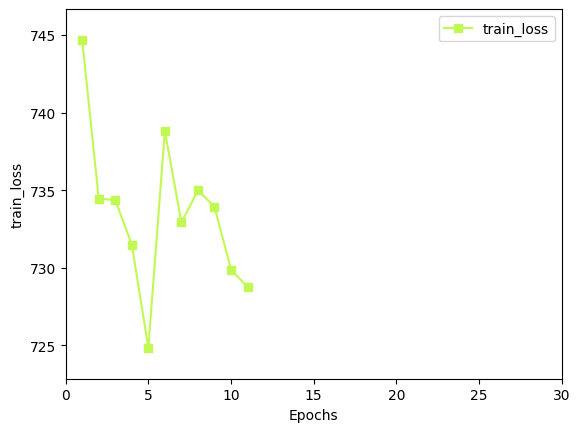
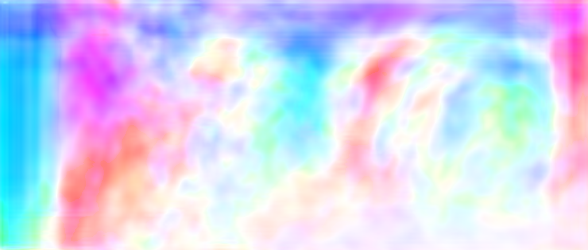

**日期**: 2021年10月8日 星期五      **姓名**: 陈勇虎 

**Plan:**

- [ ] 调试STaRFlow模型

**Do**:

- [ ] 调试运行STaRFlow模型，在单个Sintel数据集上训练

**Check**:

- [ ] 添加训练中的loss等相关数据保存到csv文件的功能，

- [ ] 添加光流结果保存为png图片的转换功能

- [ ] 等待sintel数据集的训练结果，目前只训练完成了11轮。

  
  
  从可视化的结果上也可以看出，模型还需要大量的训练。

  

**Action**:

- [ ] 继续调研光流法动态感知领域的应用算法和光流估计算法
- [ ] 阅读和学习论文源码
- [ ] 调研和收集Transformer的应用

