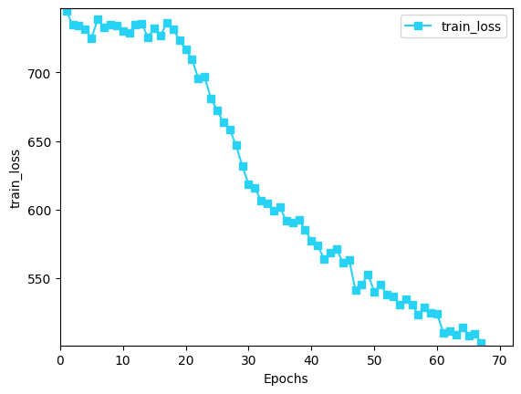

**日期**: 2021年10月9日 星期六      **姓名**: 陈勇虎 

**Plan:**

- [ ] 调试STaRFlow模型

**Do**:

- [ ] 调试运行STaRFlow模型，在单个Sintel数据集上训练

**Check**:

- [ ] 学习PWC Fusion源码

- [ ] 等待sintel数据集的训练结果，目前训练完成了68轮。

  
  
  从可视化的结果上看，目前已经可以检测出一部分的轮廓，但是从loss函数上看，模型仍需要大量的训练。

  

- [ ] MaskFlowNet使用自监督的方法获取occlusion map，并用来过滤features warping来避免由occlusion导致的模糊。可以通过类似的自监督的办法来处理occlusion的问题，同时，多帧的语义信息的补全也对occlusion的处理有积极的作用。

  后面重点调查occlusion问题的处理方案。

**Action**:

- [ ] 继续调研光流法动态感知领域的应用算法和光流估计算法
- [ ] 阅读和学习论文源码
- [ ] 调研和收集Transformer的应用
- [ ] 调研和收集处理occlusion问题的解决方案

