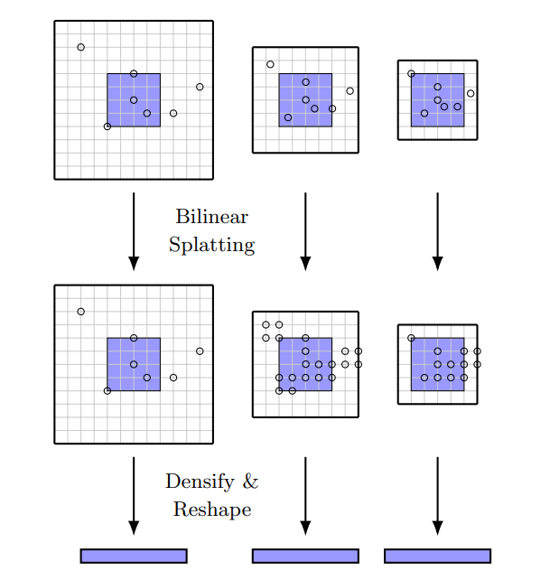

**日期**: 2021年11月1日 星期一      **姓名**: 陈勇虎 

**Plan:**

- [ ] Multi-scale Displacement Encoder

**Do**:

- [ ] Multi-scale Displacement Encoder

**Check**:

- [ ] Multi-scale Displacement Encoder

  在多个分辨率下以固定的半径创建多尺度的稀疏张量和采样位移，粗糙的分辨率将会提供更大的文本背景，而精细的分辨率则可以提供更精确的位移。然后将每一个 level 的稀疏张量转换为稠密张量并 concatenate 形成一个 2D 张量.如下图所示。
  
  
  
  在每一次迭代时，对于每个像素 $x$，从 $top-k$ 个相关位置$S_x^{(k)}$ 开始 ，因此集合 $\{(d,C(
  x,d)|d\in S_x^{(k)}\}$ 记录了对于 $X$的 $top - k$ 个相关值及其位置，这通过 $kNN$ 算法得到。
  
  构建了一个5层的稀疏Correlation Volume金字塔通过以（1，2，4，8，16）除坐标(意思就多分辨率的图像？)，并且表示在level l 的 比例化位移，通过当前的流 $\Delta f_i$ 更新的结果为 $d^l=(d_i-\Delta f_i)/2^{l-1}$。
  
  此外，在level l的相关值表示为 $C^{l}(x,d^l)=C(x,d)$ 对于 $d\in S_x^{(k)}$。在每一个level，通过常数半径 $r$ 限制了位移范围，并且定义level l的窗口相关值集合为:
  $$
  \{(d^l,C^l(x,d^l)) \mid ||d^l||_{\infty} \leq r, d\in S_x^{(k)}\}.
  $$
  因为坐标 $d^l$ 不一定是整数，所以需要重采样到整数坐标以稠密化 correlations的稀疏张量。文中提出了一种叫做”bilinear splatting“的方法，相关值将会被 bilinear splat到四个最近的整数网格中。例如， 在位置 $d^l$ 的相关值 $C^l(x,d^l)$将会被传递到四个邻近整数点的每一个，用 $[d^l]=(d_x,d_y)$ 表示，根据下式:
  $$
  C^l(x,[d^l])=(1-|d_x^l-d_x|)(1-|d_y^l-d_y|)C^l(x,d^l)
  $$
  这些值将会累加对于(5)中的集合，每一个 level 的稀疏张量也会传换成稠密张量，reshaped 并 concatenate 成一个 2D 稠密张量维度为 $5(2r + 1)^2$，这里 5 为金字塔的层数。 
  
  这个方法不含可学习参数，仅仅是稠密到稀疏张量的转换，并且比稀疏卷积容易。

**Action**:

- [ ] 继续调研光流法动态感知领域的应用算法和光流估计算法
- [ ] 阅读和学习论文源码
- [ ] 调研和收集Transformer的应用
- [ ] 调研和收集处理occlusion问题的解决方案

