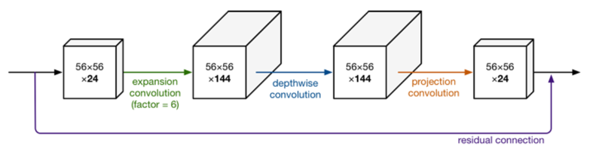

**日期**: 2021年11月10日 星期三      **姓名**: 陈勇虎 

**Plan:**

- [ ] MobileNet v1 vs MobileNet v2

**Do**:

- [ ] MobileNet v1 vs MobileNet v2

**Check**:

- [ ] MobileNet v1 vs MobileNet v2

  MobileNetV1网络主要思路就是深度可分离卷积的堆叠。在V2的网络设计中，除了继续使用深度可分离（中间那个）结构之外，还使用了Expansion layer和 Projection layer。这个projection layer也是使用 $1\times1$ 的网络结构，他的目的是希望把高维特征映射到低维空间去。使用 $1\times1$  的网络结构将高维空间映射到低纬空间的设计,称之为**Bottleneck layer。**

  **Expansion layer**的功能正相反，使用 $1\times1$  的网络结构，目的是将低维空间映射到高维空间。这里Expansion有一个超参数是维度扩展几倍。可以根据实际情况来做调整的，默认值是6，也就是扩展6倍。

  
	
  此图更详细的展示了整个模块的结构。输入是24维，最后输出也是24维。但这个过程中，扩展了6倍，然后应用深度可分离卷积进行处理。整个网络是中间胖，两头窄，像一个纺锤形。bottleneck residual block（ResNet论文中的）是中间窄两头胖，在MobileNetV2中正好反了过来，在MobileNetV2的论文中,称这样的网络结构为Inverted residuals。需要注意的是residual connection是在输入和输出的部分进行连接。另外，因为从高维向低维转换，使用ReLU激活函数可能会造成信息丢失或破坏（不使用非线性激活数数）。所以在projection convolution这一部分，不再使用ReLU激活函数而是使用线性激活函数。

**Action**:

- [ ] 调研和学习轻量化模型

