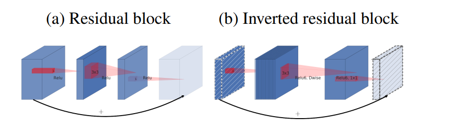

**日期**: 2021年11月17日 星期三      **姓名**: 陈勇虎 

**Plan:**

- [ ] 内存优化

**Do**:

- [ ] 内存优化

**Check**:

- [ ] 内存优化

  反向残差瓶颈层允许特别的内存高效实现，这对移动端应用非常重要。使用例如TensorFlow或者Caffe的一种标准高效的推理实现方式，是通过构建一个有向无环的计算超图 $G$，由表示操作的边和表示中间计算张量的结点组成。计算被安排进行时为了最小化存储在内存中的张量的总数。在一般的情况下，它搜索所有可能合理的计算顺序 $\sum(G)$，并且选择其中最小化下式的一项:
  $$
  M(G)=\min_{\pi \in \sum(G)} \max_{i\in 1..n}[\sum_{A\in R(i,\pi, G)}|A|] +size_{\pi_i}
  $$
  其中 $R(i,\pi,G)$ 为中间张量的列表，这些张量与 $\pi_i...\pi_n$中的结点连接。$|A|$ 代表张量 $A$ 的大小，$size(i)$ 代表操作 i 期间内部存储所需要的内存总量。
  
  对于只有平凡平行结构的图(例如残差连接)，只会由一个非平方可行的计算顺序，因此基于计算图 $G$ 的推理所使用内存总量和上界则可以简化为：
  $$
  M(G)=\max_{op\in G}[\sum_{A\in op_{inp}}|A|+\sum_{B\in op_{out}}|B|+|op|]
  $$
  或者重新说明一下，内存的总量就是所有的输入和输出(combined)的总大小的最大值。如果把 bottleneck residual block看作一个单独操作，并且将内部的卷积看作是可丢弃的张量，那么内存的总量将由 bottleneck 张量的大小决定，而不是 bottleneck 的内部张量的大小(更大)。
  
  瓶颈残差块
  
  
  
  如上图中的(b)，瓶颈块操作 $\mathcal{F}(x)$可以表达为三个操作的组合 $\mathcal{F}(x)=[A\circ \mathcal{N} \circ B]x$。在这里，
  
  * $A$ 为线性变换 $A: \mathcal{R}^{s\times s\times k} \rightarrow \mathcal{R}^{s\times s\times n}$.
  * $\mathcal{N}$ 为一个非线性的逐通道的变换 $\mathcal{N}: \mathcal{R}^{s\times s\times n} \rightarrow \mathcal{R}^{s^{\prime}\times s^{\prime}\times n}$
  * $B$ 又是一个到输出域的线性变换 $B: \mathcal{R}^{s^{\prime}\times s^{\prime}\times n} \rightarrow \mathcal{R}^{s^{\prime}\times s^{\prime}\times k^{\prime}}$.
  
  在本文的网络中，$\mathcal{N} = $ **ReLU6** $\circ$ **dwise** $\circ$ **ReLU6**，但是结果适用于任何逐通道的变换，假定输入域大小为 $|x|$，输出域大小为 $|y|$，那么计算 $F(X)$的需要的内存将会低至 $|s^2k|+|{s^{\prime}}^2k^{\prime}|+O(\max(s^2,{s^{\prime}}^2))$
  
  算法基于一个事实，内部张量 $\mathcal{I}$ 可以表示为 $t$ 个张量的连接，每一个大小为 $n/t$，那么函数就可以表示为:
  $$
  \mathcal{F}(x) = \sum_{i = 1}^t(A_i\circ N \circ B_i)*(x)
  $$
  通过累加和，则只需要在所有时刻，只在内存中保存一个大小为 $n / t$ 的中间块。如果 $n = t$，则在所有时刻只需要保留内部表示的一个通道即可。(所以是整体计算变成了滑动计算的意思？)
  
  可以使用这个技巧的两个约束条件:
  
  * 内部变换(包括非线性和深度)是逐通道的
  * 连续的非逐通道的操作需要输入和输出的比率显著
  
  对于大多数的传统神经网络，这样的技巧不会产生显著的改进效果。
  
  使用 $t$ 分割的方式来计算 $F(X)$ 的Multi-adds操作数与 $t$ 独立，但是在现在的一些实现中，使用较小的矩阵来替换乘法会损害运行时，这是因为缓存丢失的增加。这种方法最只用于 $t = 2\sim 5$ 的小常数。它显著降低了内存的需求，但仍然允许使用深度学习框架提供的高度优化的矩阵乘法和卷积算子获得的高效率。框架级别的优化是否可以带来进一步的运行时优化仍待研究。
  

**Action**:

- [ ] 调研和学习轻量化模型

