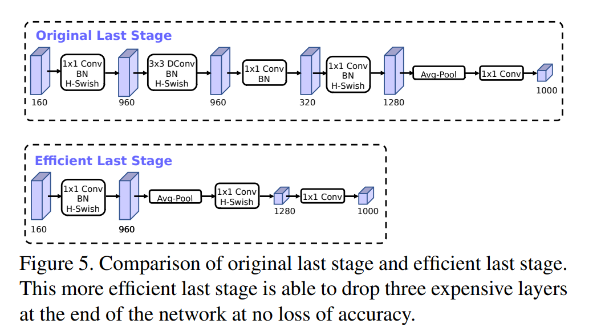
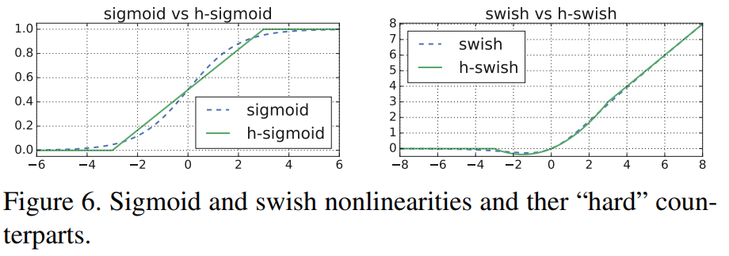

**日期**: 2021年11月19日 星期五      **姓名**: 陈勇虎 

**Plan:**

- [ ] NetWork Improvement

**Do**:

- [ ] NetWork Improvement

**Check**:

- [ ] NetWork Improvement

  除了 Network Search外，还在模型中引入了几个组件以改进最终模型。

  * 在网络的开始和结束部分重新设计计算开销较大的层
  * 引入一种新的非线性函数 h-swich，是swich的改进，计算速度更快，也更适合量化

  **Redesigning Expensive Layers**

  架构搜索找到模型之后，网络的开始和结束部分的很多层的计算代价很高，因此对模型架构进行了修改来减少这一部分层的延迟，同时保持正确性。这些改进是在当前搜索空间以外的。

  第一个修改改进了网络最后几次的交互，以便更有效地生成最终的特征。目前基于MobileNetv2地inverted bottleneck 结构和变种地模型使用 $1\times 1$卷积作为最后一层，以扩展到更高维度地特征空间。这一层是至关重要的，为了能够获得更富集的特征用于预测，然而吗，这是以额外的延迟为代价的。

  为了减少延迟并保留高维的特征，将这一层移到了最后的平均池化层。最后的一组特征将以$1\times1$ 的空间分辨率计算而不是 $7\times 7$空间分辨率。这种设计选择的结果是，特征的计算在计算和延迟方面上几乎free。

  一旦减轻了特征生成层的计算代价，就不需要使用之前的bottleneck projection 层来减少计算量。从而可以移除前面bottleneck层中的projection和filtering层，进一步降低计算复杂度。原始和优化后的最终阶段图下所示。有效的最后阶段减少了7ms的延迟，这是运行时的11%，减少了3000层MAdds的操作数量，并且几乎没有降低正确性。

  

  另一个计算代价高的层就是初始的一组滤波器。目前的移动模型倾向于在一个完整的 $3\times 3$ 卷积中使用 32个

  滤波器来构建边缘检测的初始滤波器组。这些滤波器通常是彼此的镜像。尝试减少滤波器的数量，使用不同的非线性来尝试减少冗余。最后选定在这一层使用 hard swish非线性函数，因此在测试中它的性能其他非线性相当。可以将滤波器的数量减少到16个，同时使用 ReLU或 swish保持与 32个滤波器相同的精度。这额外减少了2ms 的运行时和 1000万的MAdds计算量。

  **Nonlinearities**

  [...]引入了 swish 非线性函数把他作为 ReLU的临时替代，并且显著提高了神经网络的准确性。这个非线性函数定义为：
  $$
  swish(x)=x \cdot \sigma(x)
  $$
  尽管这种非线性提高了精度，但是它在嵌入式环境中的代价非零，因为在移动设备上计算 sigmoid函数代价较高。使用两种方法来处理这个问题：

  * 类似于[..]，将sigmoid函数替换为它的分段线性硬模拟函数: $\frac{ReLU6(x+3)}{6}$, 最小的区别就是使用 ReLU6而不是传统的裁剪常量。类似的，硬版本的 swish 就变成了:
    $$
    h-swish(x)=x\frac{ReLU6(x+3)}{6}
    $$
    [...]也提出了一个版本的hard-swish。 sigmoid和swish的对比图如下所示。

    

    常量的选择动机就是简化并且尽可能好的匹配原始版本。实验中发现所有这些功能在 hard 版上的准确性没有明显的差异，但是在部署的角度上却有很多优势：

    * 在几乎所有的软硬件框架下都有ReLU6的优化实现
    * 在量化模式下，消除了由于不同的近似 sigmoid实现可能造成的数值精度损失
    * 在实践中，h-swish 可以实现为分段函数来减少内存访问的次数，从而大大降低延迟的成本

  * 应用非线性函数的代价会随着网络的深入而降低，因为每一层的激活体内存会在分辨率下降时减半。只有在更深的层次中使用才可以实现 swish 的大部分的优势。因此，在网络架构的后半部分使用h-swish。

  尽管有了这些优化，h-swish仍然会带来一些延迟代价。但网络对精确度和延迟上，在没有优化的情况下是积极的，在使用基于分段函数的优化实现时，影响是显著的。

**Action**:

- [ ] 调研和学习轻量化模型

