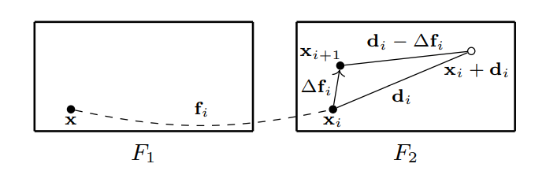

**日期**: 2021年11月2日 星期二      **姓名**: 陈勇虎 

**Plan:**

- [ ] kNN & Displacements Update

**Do**:

- [ ] kNN & Displacements Update

**Check**:

- [ ] k-Nearest Neighbours选取主要特征

  使用了两个共享权重的提取网络从输入的图像中获取 1/4 分辨率的特征图。特征提取网络包含了 6 个 residual blocks，特征通道数为 256。为了构建稀疏Correlation Volume，使用了一个 KNN 模块(论文中有参考文献)去计算对于 $F_1$的每个特征向量的最大的 $k$ 个相关得分的索引集合。稀疏Correlation Volume通过 $F_1$ 的每个特征向量与 $F_2$ 由索引得到的前 $k$ 个特征向量的点积。在back-propagation阶段，梯度也仅会传到由 KNN 模块选择到的 k 个特征向量。

- [ ] Displacements Updates  更新模块

  采用了全局的迭代精化方法，估计残差流可以有效的减少搜索空间并且可以比直接回归预测到更好的结果。与直接预测光流场 $f$ 不同，残差流 $\Delta f_{i+ 1}$ 是每一步预测并且用来更新当前的光流估计结果 $f_{i + 1} = f_i + \Delta f_{i + 1}$。

  在每一步，对于 $F_1$ 的一个像素 $x$，将会根据当前的光流预计结果映射到 $F_2$ 中的 $x_i = x + f_i$。稀疏Correlation Volume可以看成初始光流$f_0 = 0(i = 0)$。当坐标$x_i$更新到$x_{i+1}=x_i+\Delta f_i$， $\tilde{\mathcal{C}}$中对应的位移也会同样更新。可以通过在每一步中从 $d_i$ 中减去 k 最近的 $\Delta f_i$ 来shift稀疏Correlation Volume张量的坐标，$C_i(x,d_i)=C_{i+1}(x,d_i - \Delta f_i)$。  如下图所示。并且设定为$d_i-\Delta f_i$为浮点值。需要注意的是，内积只会在最开始的时候计算一次，因为在每一步中，只有相关坐标发生变化，相关值不会发生变化。

  

**Action**:

- [ ] 继续调研光流法动态感知领域的应用算法和光流估计算法
- [ ] 阅读和学习论文源码
- [ ] 调研和收集Transformer的应用
- [ ] 调研和收集处理occlusion问题的解决方案

