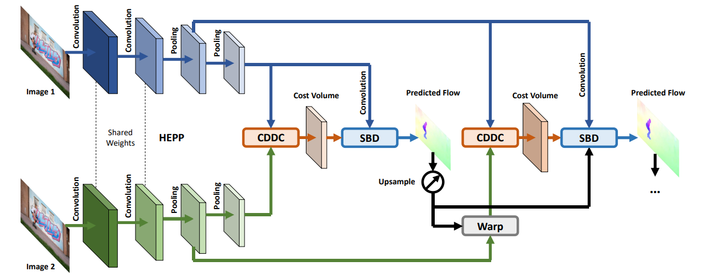

**日期**: 2021年11月3日 星期三      **姓名**: 陈勇虎 

**Plan:**

- [ ] FastFlowNet

**Do**:

- [ ] FastFlowNet

**Check**:

- [ ] FastFlowNet 仍然使用了广泛应用的 coarse-to-fine 策略，此外还有以下几个创新点。

  * 使用了一个 head enhanced pooling pyramid (HEPP) 特征提取器，在减少参数的同时增强了高分辨率的金字塔特征。

  * 引入了一个 center dense dilated correlation (CDDC)层 用于构建紧凑的代价体，并且可以保持较大的搜索半径下减少计算量。

  * 在每个金字塔层中植入了一个有效的 shuffle block decoder (SBD) 用于加速光流估计，不过边缘精度有所下降。但是相比同样精度的网络，只需要 $1/10$ 的计算量。

  FastFlowNet 只含有1.37M 个参数，对于一个分辨率为 $1024\times436$ 的Sintel图片，在单个 GTX 1080Ti 下可以做到 90 FPS，嵌入JetSon TX2 GPU 可以做到 5.7 FPS。

  

  给定两个时间域相邻的输入图片$I_1,I_2 \in \mathbb{R}^{H \times W \times 3}$, 提出的 FastFlowNet 模型将会利用由粗到细的残差结构来逐渐估计精化后的光流 $F^{l} \in \mathbb{R}^{H^l \times W^l \times 2}, l = 6,5,\cdots,2.$ 但是通过修改去减少参数和计算代价来加速推理。为此，首先替换了 PWC-Net 网络中的对偶卷积特征金字塔为 头增强的池化金字塔 (head enhanced pooling pyramid) 来增强高精度分辨率的金字塔特征和减少模型的尺寸。在此基础上，提出了一种新得中心密集扩张相关层(center dense dilated correlation layer)，在保证大的搜索半径得前提下，构造紧凑得代价体。最后，在每个金字塔层使用新的shuffle 块译码器 (shuffle block decoders) 来回归计算光流。

**Action**:

- [ ] 继续调研光流法动态感知领域的应用算法和光流估计算法
- [ ] 阅读和学习论文源码
- [ ] 调研和收集Transformer的应用
- [ ] 调研和收集处理occlusion问题的解决方案

