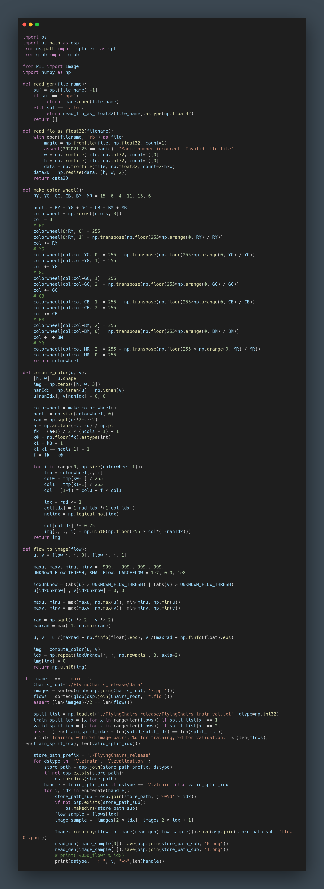

**日期**: 2021年11月30日 星期二      **姓名**: 陈勇虎 

**Plan:**

- [ ] 数据集类型转换代码

**Do**:

- [ ] 数据集类型转换代码

**Check**:

- [ ] 为了方便后续的实验对比，将FlyingChairs数据集中的所有数据转换成png图片并存储。

  

**Action**:.

- [ ] 修改FlyingChairs的数据处理部分，封装成多帧下的datasets
- [ ] 修改FlowDatasets，FlowAugment等基础类的功能
- [ ] 整理多帧数据处理流程，搭建多帧框架

