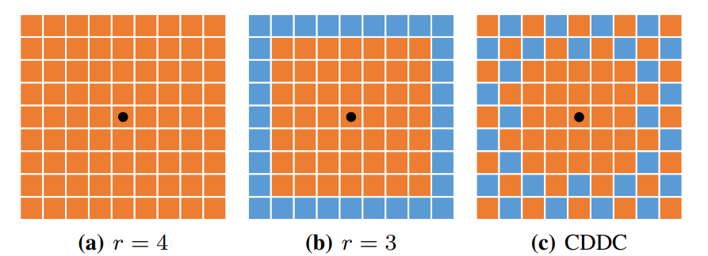

**日期**: 2021年11月4日 星期四      **姓名**: 陈勇虎 

**Plan:**

- [ ] Center Dense Dilated Correlation

**Do**:

- [ ] Center Dense Dilated Correlation

**Check**:

- [ ] Center Dense Dilated Correlation

  现代的光流估计架构中的一个重要的步骤就是通过基于卷积层的内积来计算特征一致性。对于金字塔 $l$ 层的两个特征 $f^l_1, f^l_2$ ，类似很多由粗到细的残差方法，首先使用了基于 warping 的双线性插值，根据 $2\times$前面的流场的上采样的结果 $up_2(F^{l+1})$ 对第二个特征 $f^l_2$ 进行 warp。warp 的目标特征 $f_{warp}^l$ 可以极大的减少由于大尺度运动带来的位移，这将有益于减少搜索区域和简化任务为估计相对较小的残差流。最近的工作 PWC-Net，LiteFlowNet 通过在局部方形区域内相关源特征和对应的warped后的目标特征构建代价体，可公式化为：
  $$
  c^l(x,d)=f^l_1(x)\cdot f_{warp}^l(x+d)/N, d\in [-r, r] \times[-r, r]
  $$
  $x, d$ 代表空间和偏移坐标，$N$ 为输入特征的长度，$r$ 为搜索半径，$\cdot$ 代表点积。

  已有的工作PWC-Net等已经表明，在构建代价体时增加搜索半径可以在训练和测试中降低 EPE 误差，尤其对于大位移的情况。但是代价体的特征通道时搜索半径的平方级，后续的解码器网络的计算复杂度将会变成四次方。

  

  如图 $a$，很多的光流网络设置 $r = 4$，庞大的计算量阻碍了低功耗应用的发展。一种简单的方法就是减小半径  $r$。例如设置 $r = 3$， 如图 $b$。从而使代价体特征从 81 减少到 49. 但是这种办法的代价是牺牲了感知范围和精度。

  受到 DeepLabv3 的 atrous spatial pyramid pooling(ASPP) 的启发，提出了CDDC层在大运动区域内下采样网格点时，在中心周围密集搜索格点，如图 $c$ 所示。

  与 ASPP 使用并行 atrous 卷积来获取多尺度上下文信息不同，提出的 CDDC 旨在减少构建大半径代价体时的计算量。在 FastFlowNet 中，会输出 53 个特征通道，与传统的 $r=3$ 设置类似。动机在于残差流会更关注小运动。实验证明 CDDC 方法比传统的压缩方法更优。

**Action**:

- [ ] 继续调研光流法动态感知领域的应用算法和光流估计算法
- [ ] 阅读和学习论文源码
- [ ] 调研和收集Transformer的应用
- [ ] 调研和收集处理occlusion问题的解决方案

