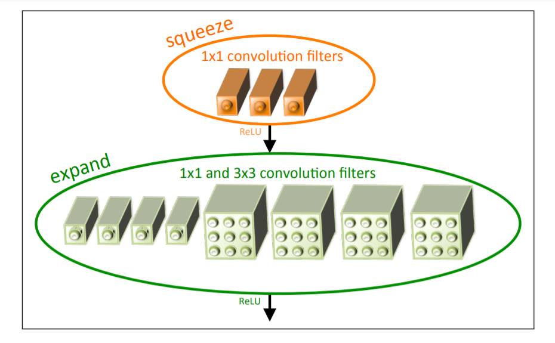

**日期**: 2021年11月5日 星期五      **姓名**: 陈勇虎 

**Plan:**

- [ ] SqueezeNet

**Do**:

- [ ] SqueezeNet

**Check**:

- [ ] SqueezeNet: Preserving accuracy with few parameters

  设计策略：

  主要目标是构建参数较少的 CNN 模型架构，但是仍保持不错的精度。为此，使用了三个主要策略。

  * 策略 $1$ : 使用 $1 \times 1$ 过滤器替换 $3 \times 3$ 过滤器。给定一定数量的卷积滤波器预算，这大部分的滤波器将使用 $1\times 1$ 大小，因为 $1\times 1$ 滤波器将比 $3 \times 3$ 滤波器减少了九倍的参数。

  * 策略 $2$ : 减少输入到 $3 \times 3$ 滤波器的输入通道数。对于一个只包含 $3\times 3$ 滤波器的卷积层，这一层的参数总数等于

    (number of channels)  * (number of filters) * (3 * 3)。因此，为了保持 CNN 中较少的参数总数，不仅要减少$3\times 3$滤波器的个数，还需要减少输入的通道数。后面使用 squeeze layers 来减少输入到滤波器的输入通道数。

  * 策略 $3$ : 在网络的后期进行下采样，使卷积层有较大的激活图。在卷积网络中，每个卷积层产生一个输出激活映射，其空间分辨率至少为 $1\times 1$，并且通常大于 $1 \times 1$。这些激活映射图的宽和高由 (1) 输入数据的大小，(2) 在CNN中选择用哪些层来做下采样。常见的是，通过在 CNN 结构的一些卷积层或者池化层设置步长 (stride > 1)。如果网络前面的层有较大的步长，那么大部分的激活层就会很小。相反地，如果网络中大部分的层的步长为 $1$, 并且步长大于 $1$ 的层都集中在网络末端，那么网络中的大部分层就会有大的激活图。在其他条件不变得情况下，直觉上看，大的激活图将会导致更高的分类精度。

  策略$1,2$ 是明智得减少 CNN 中得参数数量，并试图保持准确率。策略 3 是在有限的参数预算下最大化准确性。

  **The Fire Module**

  定义 Fire 模块。一个 Fire 模块包含一个 squeeze convolution layer，然后被送到一个 expand layer, 或者扩展层包含了 $1\times1$ 和 $3\times 3$ 两种卷积核。如下图所示。

  

  在 Fire 模块中提供了三个可调的维度(超参数)： $s_{1x1},e_{1x1},e_{3x3}$。 $s_{1x1}$是 squeeze layer中的 $1\times1$ 滤波器个数，$e_{1x1}$ 是 expand 层中的 $1\times1$ 滤波器个数，$e_{3x3}$ 是 expand 层中的 $3\times3$ 滤波器个数。在使用 Fire 模块时，设定了 $s_{1x1} \lt (e_{1x1},e_{3x3})$， 因此 squeeze layer 将有助于减少输入到 $3\times 3$ 的输入通道数。

**Action**:

- [ ] 调研和学习轻量化模型

