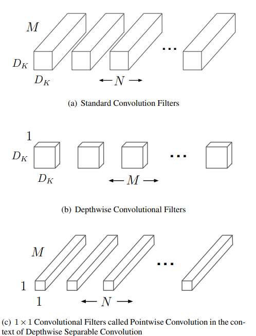

**日期**: 2021年11月9日 星期二      **姓名**: 陈勇虎 

**Plan:**

- [ ] Depthwise Separable Convolution

**Do**:

- [ ] Depthwise Separable Convolution

**Check**:

- [ ] Depthwise Separable Convolution

  深度可分离卷积，是一种分解卷积的形式，它将标准的卷积分解为深度卷积和一个 $1\times1$ 的称为点态卷积的卷积。下图为标准卷积分解为深度卷积和 $1\times1$ 点态卷积的过程。

  

  对于标准的卷积（假定步长为一并含有填充）的输出特征图则可以计算为:
  $$
  G_{k,l,n}=\sum_{i,j,m}K_{i,j,m,n}\cdot F_{k+i-1,l+j-1,m}
  $$
  因此标准的计算代价为：
  $$
  D_K \cdot D_K \cdot M \cdot N \cdot D_F \cdot D_F
  $$
  即依赖于输入的卷积核大小，输入输出通道数，输出的特征图大小。

  

  标准的卷积操作在卷积核的基础上对特征进行过滤，并结合特征产生新的表示。滤波和组合步骤可以通过分解卷积分为两个步骤，这种分解叫做深度可分离卷积并且可以后续减少计算代价。

  深度可分离卷积由于两层构成：深度卷积和点态卷积。使用深度卷积对每个输入通道(输入深度)应用一个简单的滤波器。点态卷积，一个简单的$1\times 1$ 卷积，用来创建深度卷积层输出的线性组合。MobileNets 对这两层都使用了batchnorm 和 ReLU非线性激活函数。

  对每一个输入通道（输出通道）使用一个滤波器进行深度卷积可以表达为：
  $$
  \hat{G}_{k,l,m}=\sum_{i,j}\hat{K}_{i,j,m}\cdot F_{k+i-1,l+j-1,m}
  $$
  这里 $\hat{K}$ 为深度卷积核，大小为 $D_K \times D_K \times M$ , $\hat{K}$ 第 $m_{th}$ 个滤波器应用在 $F$ 的 $m_{th}$通道，并产生输出特征图 $\hat{G}$ 的第 $m_{th}$ 个通道。

  深度卷积的计算代价为:
  $$
  D_K \cdot D_K \cdot M \cdot D_F \cdot D_F
  $$
  深度可分离卷积的代价为：
  $$
  D_K \cdot D_K \cdot M \cdot D_F \cdot D_F + M \cdot N \cdot D_F \cdot D_F
  $$
  即深度卷积$1\times1$点态卷积的代价总和。

  通过将卷积表达为两个步骤（滤波和组合）可以得到计算代价的减少：
  $$
  \begin{align}
   &\frac{D_K \cdot D_K \cdot M \cdot D_F \cdot D_F + M \cdot N \cdot D_F \cdot D_F}{D_K \cdot D_K \cdot M \cdot N \cdot D_F \cdot D_F} \notag \\ 
  =&\frac{1}{N} + \frac{1}{D_K^2} \notag
  \end{align}。
  $$

- 

**Action**:

- [ ] 调研和学习轻量化模型

