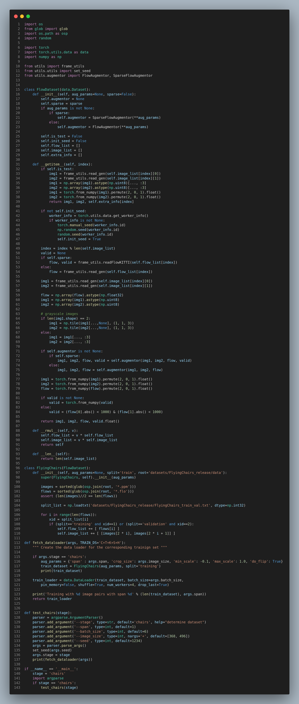

**日期**: 2021年12月1日 星期一      **姓名**: 陈勇虎 

**Plan:**

- [ ] 分析raft模型结果，调试修改raft模型

**Do**:

- [ ] 分析raft模型结果，调试修改raft模型

**Check**:

- [ ] 修改FlyingChairs的数据处理部分，即FlyingChairs的datasets类的实现

  

**Action**:.

- [ ] 修改FlyingThings3D的数据处理部分，封装成多帧下的datasets
- [ ] 调试和修改实现的FlowDatasets，FlowAugment等基础类的功能
- [ ] 整理多帧数据处理流程，搭建多帧框架

