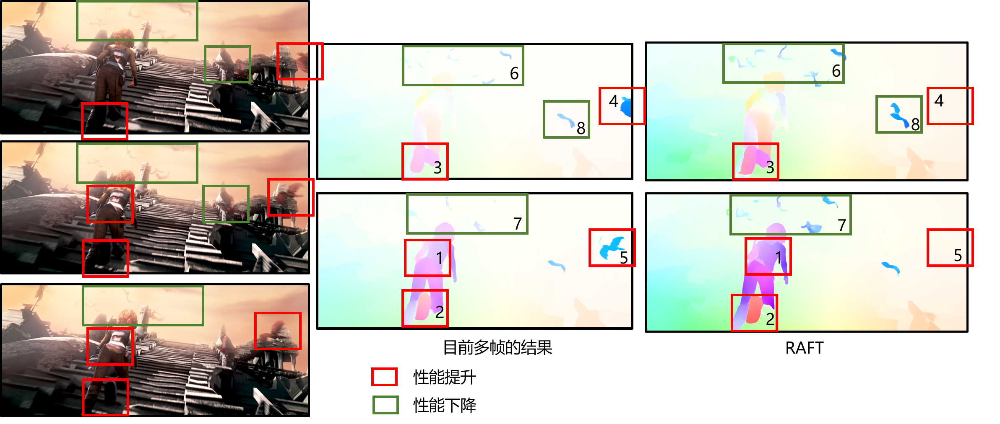

**日期**: 2021年12月27日 星期一      **姓名**: 陈勇虎 

**Plan:**

- [ ] 修改融合模块

**Do**:

- [ ] 修改融合模块

**Check**:

- [ ] 修改融合模块

  

  在大部分的连续帧中，连续的运动得到了一定的改善，如上图中的1，2，3，4，5方框部分。

  但是也存在运动丢失的情况，如6，7，8方框部分。

  原因分析：
  
  目前将帧间特征直接传递(concat)，导致误差逐帧传递，经过多帧后，模糊的特征融被模块丢弃。
  
  后续做四大组实验：
  
  * torch.add融合特征 
  * torch.add融合特征，帧间设定$\gamma$ 权重，$\gamma$的可学习性待定
  * correlation求解匹配代价体，根据匹配代价体，对$f_{t-1}$的特征进行权重修改
  * attention, 利用$f_t$构建attention map, 对$f_{t-1}$的特征进行权重修改

  先做1, 4两组实验。

**Action**:

- [ ] non-local attention vs global attention

- [ ] knn滞后

  

