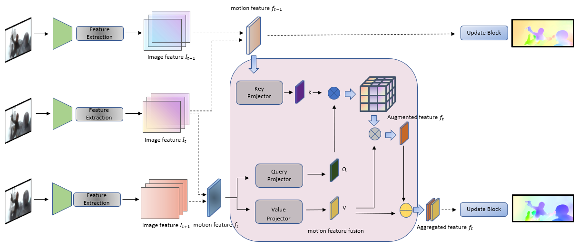

**日期**: 2021年12月28日 星期二      **姓名**: 陈勇虎 

**Plan:**

- [ ] 修改融合模块

**Do**:

- [ ] 修改融合模块

**Check**:

- [ ] 修改融合模块

  构建$f_t$ 和$f_{t-1}$的attention map，根据attention_map对$f_t$中的运动特征进行增强。

  新的算法框架示意图如下。等待训练结束。

  

**Action**:

- [ ] 学习各种attention

- [ ] local attention vs multi-head attention

  

