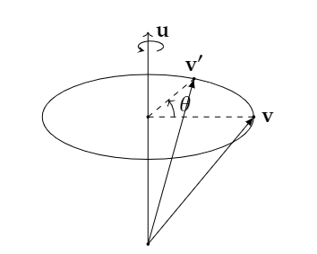
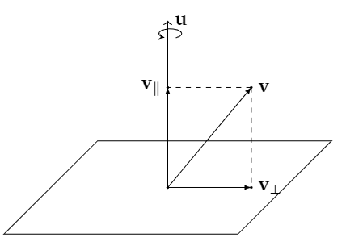
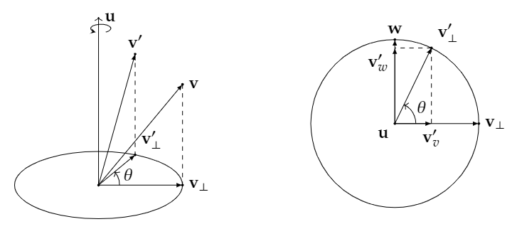

**日期**: 2021年8月25日 星期三      **姓名**: 陈勇虎 

**Plan:**

- [ ] 阅读《DeepMatching: Hierarchical Deformable Dense Matching》[1]

**Do**:

1. 阅读《DeepMatching: Hierarchical Deformable Dense Matching》

**Check**:

1. 论文的关键是构建多尺度的相关金字塔，如下图所示：

   

   随后根据得到的金字塔回溯每个点的对应关系，如下图所示：

   

   因此匹配的过程首先是一个bottom-up的构建过程，然后是一个top-down的回溯的过程。这篇论文提出的思想在DeepFlow模型的中就已经使用[2]。

2. **三维空间的旋转**[3]

   欧拉角的表示方法会导致**Gimbal Lock**问题，而且依赖于坐标轴的选定，因此考虑轴角式的旋转。

   考虑将一个向量$\boldsymbol{v}$，沿着旋转轴$\boldsymbol{u}=(x,y,z)^{T}$旋转$\theta$度，得到$\boldsymbol{v}^{\prime}$:

   

   先进行旋转的分解，把$\boldsymbol{v}$分解成**平行**于旋转轴$\boldsymbol{u}$以及**正交**于$\boldsymbol{u}$的两个分量：$\boldsymbol{v}_{\parallel},\boldsymbol{v}_{\perp}$，即：
   $$
   \boldsymbol{v} = \boldsymbol{v}_{\parallel} + \boldsymbol{v}_{\perp}
   $$
   可以分别旋转这两个分向量，再将他们旋转的结果相加获得旋转后的向量：
   $$
   \boldsymbol{v}^{\prime} = \boldsymbol{v}_{\parallel}^{\prime} + \boldsymbol{v}_{\perp}^{\prime}
   $$
   

   从正交投影公式，可以得出:
   $$
   \boldsymbol{v}_{\parallel} = proj_u{\boldsymbol{v}} = \frac{\boldsymbol{u}\cdot\boldsymbol{v}}{||\boldsymbol{u}||^2}\boldsymbol{u} = (\boldsymbol{u}\cdot\boldsymbol{v})\boldsymbol{u}
   $$
   由于$\boldsymbol{v} = \boldsymbol{v}_{\parallel} + \boldsymbol{v}_{\perp}$，于是有：$\boldsymbol{v}_{\perp} = \boldsymbol{v} - \boldsymbol{v}_{\parallel} = \boldsymbol{v} - (\boldsymbol{u}\cdot\boldsymbol{v})\boldsymbol{u}$

   对于$\boldsymbol{v}_{\parallel}$的旋转，仍然与旋转轴$\boldsymbol{u}$重合，因此$\boldsymbol{v}_{\parallel}^{\prime}=\boldsymbol{v}_{\parallel}$

   对于$\boldsymbol{v}_{\perp}$，利用三角的知识可以得到:

   
   $$
   \begin{align}
   \boldsymbol{v}_{\perp}^{\prime}&=\boldsymbol{v}_{v}^{\prime}+\boldsymbol{v}_{w}^{\prime}\notag\\
   &= \cos(\theta)\boldsymbol{v}_{\perp}+\sin(\theta)\boldsymbol{w}\notag\\
   &= \cos(\theta)\boldsymbol{v}_{\perp}+\sin(\theta)(\boldsymbol{u}\times\boldsymbol{v}_{\perp})
   \end{align}
   $$
   从而有:
   $$
   \begin{align}
   \boldsymbol{v}^{\prime} &= \boldsymbol{v}_{\parallel}^{\prime} + \boldsymbol{v}_{\perp}^{\prime}\notag \\
   &=\boldsymbol{v}_{\parallel} + \cos(\theta)\boldsymbol{v}_{\perp}+\sin(\theta)(\boldsymbol{u}\times\boldsymbol{v}_{\perp})\notag\\
   &=(\boldsymbol{u}\cdot\boldsymbol{v})\boldsymbol{u}+\cos(\theta)(\boldsymbol{v} - (\boldsymbol{u}\cdot\boldsymbol{v})\boldsymbol{u})+\sin(\theta)(\boldsymbol{u}\times\boldsymbol{v})\notag\\
   &=\cos(\theta)\boldsymbol{v} +(1-\cos(\theta)) (\boldsymbol{u}\cdot\boldsymbol{v})\boldsymbol{u}+\sin(\theta)(\boldsymbol{u}\times\boldsymbol{v})
   \end{align}
   $$

**Action**:

1.  继续调研光流法动态感知领域的应用算法和光流估计算法

**Reference:**

1. Revaud, J., Weinzaepfel, P., Harchaoui, Z. *et al.* DeepMatching: Hierarchical Deformable Dense Matching. *Int J Comput Vis* 120, 300–323 (2016). https://doi.org/10.1007/s11263-016-0908-3
2. Philippe Weinzaepfel, Jerome Revaud, Zaid Harchaoui, Cordelia Schmid:Proceedings of the IEEE International Conference on Computer Vision (ICCV), 2013, pp. 1385-1392
3. https://krasjet.github.io/quaternion/  

