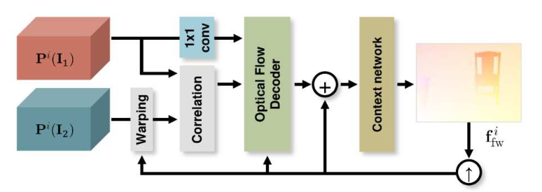

**日期**: 2021年9月10日 星期五      **姓名**: 陈勇虎 

**Plan:**

- [ ] 阅读论文《Iterative Residual Refinement for Joint Optical Flow and Occlusion Estimation》[1]

**Do**:

- [ ] 阅读论文《Iterative Residual Refinement for Joint Optical Flow and Occlusion Estimation》

**Check**:

- [ ] 阅读论文《Iterative Residual Refinement for Joint Optical Flow and Occlusion Estimation》

  

  Key ideas

  - Take the output from a previous pass through the network as input and iteratively refine it by only using a single network block with shared weights, which allows the network to residually refine the previous estimate.
  - For PWCNet, the decoder module at different pyramid level is achieved using a 1x1 convolution before feeding the source feature map to the optical flow estimator/decoder.
  - Joint occlusion and bidirectional optical flow estimation leads to further performance enhancement.

  在结构上，与下图中的PWC-Net结构相比，文中提出的IRR模型与原始的PWC-Net的不同之处在于，PWC-Net是在不同的尺度上做各自的光流估计，然而IRR模型确实在原始的空间分辨率上，因此，模型中可以采用一个共享权重的解码器，并且可以在不同层级上使用。

  

  在训练的损失函数上，文中对前向和后向光流使用了正则项：
  $$
  l_{\text {flow }}^{i}=\frac{1}{2} \sum\left(\left\|\mathbf{f}_{\mathrm{fw}}^{i}-\mathbf{f}_{\mathrm{fw}, \mathrm{GT}}\right\|_{2}+\left\|\mathbf{f}_{\mathrm{bw}}^{i}-\mathbf{f}_{\mathrm{bw}, \mathrm{GT}}\right\|_{2}\right)
  $$
  在occlusion map上使用了加权的二进制交叉熵函数：
  $$
  \begin{aligned}
      l_{\mathrm{occ}}^{i}=-\frac{1}{2} \sum &\left(w_{1}^{i} o_{1}^{i} \log o_{1, \mathrm{GT}}+\bar{w}_{1}^{i}\left(1-o_{1}^{i}\right) \log \left(1-o_{1, \mathrm{GT}}\right)\right.\\
      &\left.+w_{2}^{i} o_{2}^{i} \log o_{2, \mathrm{GT}}+\bar{w}_{2}^{i}\left(1-o_{2}^{i}\right) \log \left(1-o_{2, \mathrm{GT}}\right)\right)
  \end{aligned}
  $$
  这里面是考虑到了预测的数量和真实的标签，因此设置了权重$w_1^i=\frac{H\cdot W}{\sum o_1^i + \sum o_{1,GT}}$ 和 $\bar{w}_1^i=\frac{H\cdot W}{\sum (1 - o_1^i) + \sum (1 - o_{1,GT})}$ 。

  最终的损失函数是两者的加权和，针对FlowNet和PWC-Net，表达式分别为：
  $$
  l_{\text {FlowNet }}=\frac{1}{N} \sum_{i=1}^{N} \sum_{s=s_{0}}^{S} \alpha_{s}\left(l_{\text {flow }}^{i, s}+\lambda \cdot l_{\mathrm{occ}}^{i, s}\right)
  $$

  $$
  l_{\text {PWC-Net }}=\frac{1}{N} \sum_{i=1}^{N} \alpha_{i}\left(l_{\text {flow }}^{i}+\lambda \cdot l_{\mathrm{occ}}^{i}\right)
  $$

**Action**:

- [ ] 继续调研光流法动态感知领域的应用算法和光流估计算法
- [ ] 阅读和学习论文源码
- [ ] 调研和收集Transformer的应用

**Reference:**

1. Hur, Junhwa, and Stefan Roth. 2019. “Iterative Residual Refinement for Joint Optical Flow and Occlusion Estimation.” In *2019 IEEE/CVF Conference on Computer Vision and Pattern Recognition (CVPR)*, 5747–56. Long Beach, CA, USA: IEEE. https://doi.org/10.1109/CVPR.2019.00590.

