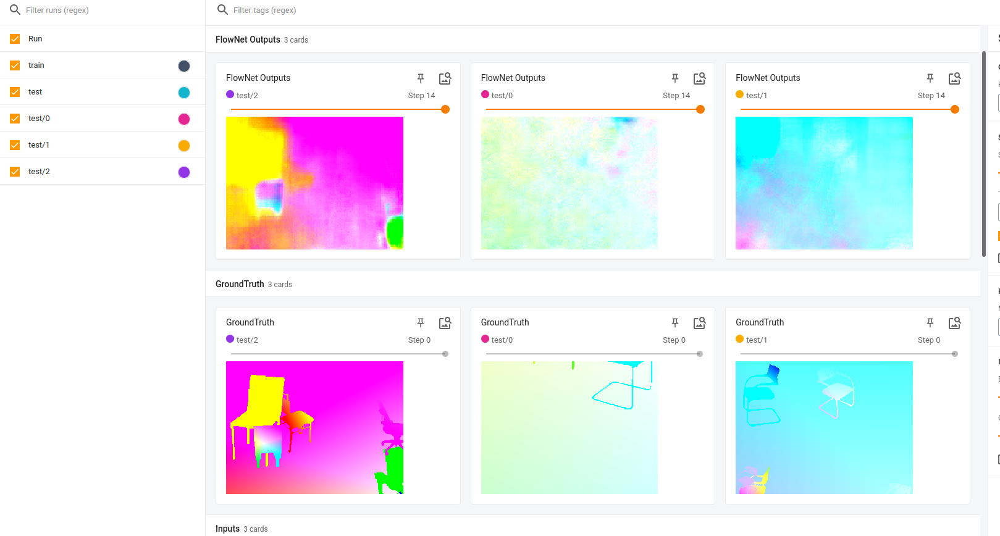
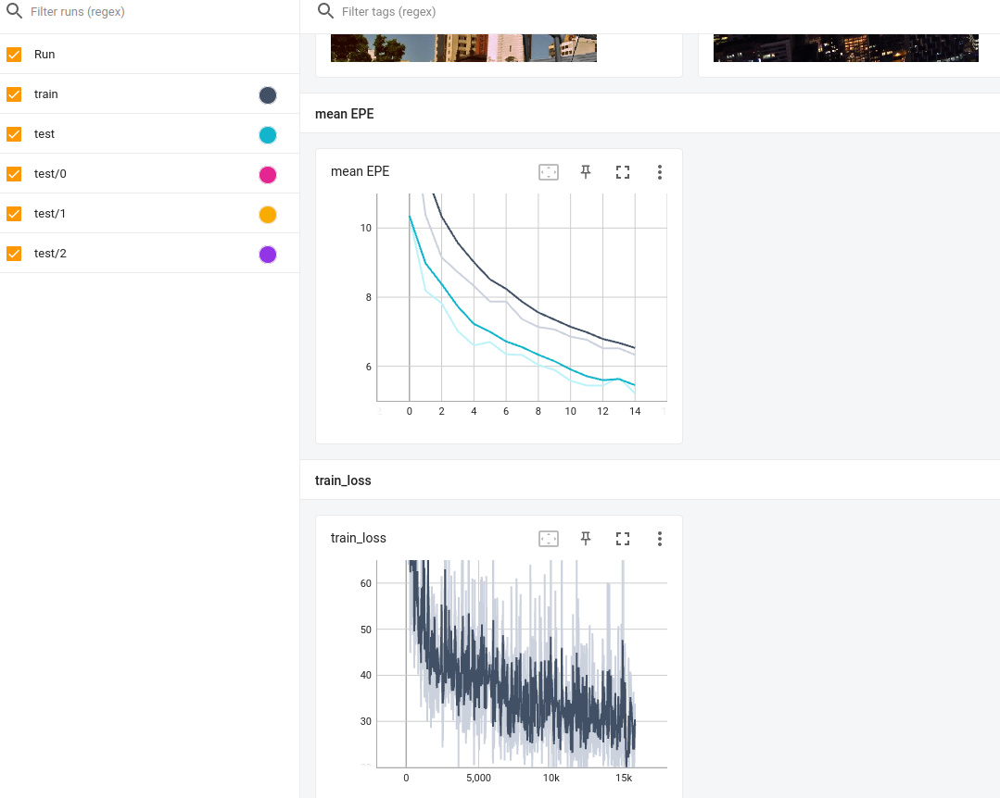

日期: 2021年9月16日 星期四        姓名:  陈勇虎   

- [ ] 运行和学习FlowNet的代码

- [ ] 运行和学习FlowNet的代码

- [ ] 运行和学习FlowNet的代码，添加checkpoints观察训练情况

  
  
  从保存的光流图数据看，训练14轮远远不够，而且训练损失还在持续下降阶段，精度也在上升阶段，需要提高学习率和增加训练次数。
  
  

- [ ] 继续调研光流法动态感知领域的应用算法和光流估计算法
- [ ] 阅读和学习论文源码
- [ ] 重构PWC-Net源码解决版本不匹配带来的诸多问题，尽量修改和编译好官方的代码
- [ ] 调研和收集Transformer的应用

