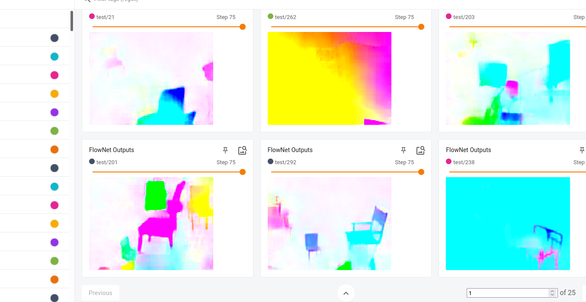

**日期**: 2021年9月17日 星期五      **姓名**: 陈勇虎 

**Plan:**

- [ ] 阅读论文《Learning to Estimate Hidden Motions with Global Motion Aggregation》[1]

**Do**:

- [ ] 阅读论文《Learning to Estimate Hidden Motions with Global Motion Aggregation》

**Check**:

- [ ] 阅读论文《Learning to Estimate Hidden Motions with Global Motion Aggregation》

  模型是建立在2020年RAFT模型的基础上的，比较特殊的地方是使用了transformer，与传统的

  transformer不一样的地方在于并没有严格使用自注意力机制，因为使用的Value vectors从运动特征获得，而Query和Key vector则是从图片的文本特征获取。后续将对模型细节从代码角度做深入了解。

  

- [ ] 加大了FlowNet的迭代次数，模型精度在提升，但是occlusions带来的影响也越来越严重。但是模型仍未收敛，模型还在精度提升中，后续开始调试PWC和RAFT模型，以及最新的使用transformer的GMA模型，将GMA以PWC-Fusion的范式用于预测多帧光流估计。

**Action**:

- [ ] 继续调研光流法动态感知领域的应用算法和光流估计算法
- [ ] 详细阅读论文《Learning to Estimate Hidden Motions with Global Motion Aggregation》
- [ ] 阅读和学习论文源码
- [ ] 调研和收集Transformer的应用

**Reference:**

1. Jiang, Shihao, Dylan Campbell, Yao Lu, Hongdong Li, and Richard Hartley. 2021. “Learning to Estimate Hidden Motions with Global Motion Aggregation.” *ArXiv:2104.02409 [Cs]*, July. http://arxiv.org/abs/2104.02409.

   

