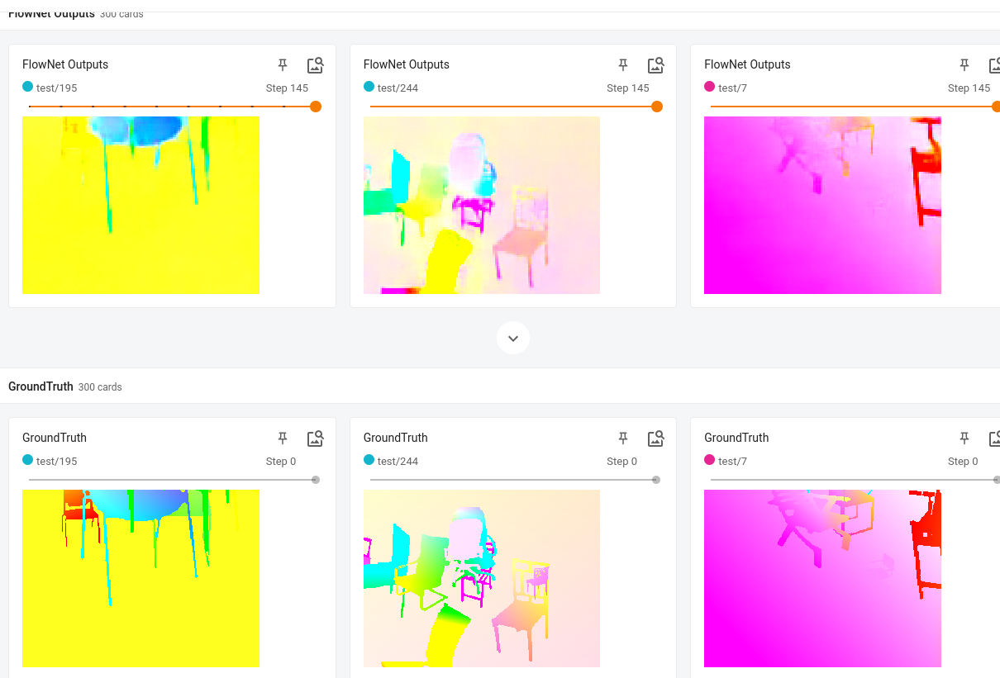
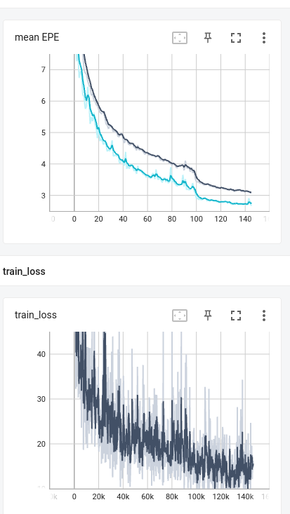

日期: 2021年9月18日 星期六        姓名:  陈勇虎   

- [ ] 调试和训练Flownet

- [ ] 调试和训练Flownet

- [ ] 调试和训练Flownet

  训练到145轮以后，模型预测结果比较可观。

  

在损失函数上,模型的精度也在下降中，损失函数有一定的波动，但是测试集的EPE没有逐渐出现上升的情况，因此模型暂时没有过拟合，精度还会有一定的提高。

- [ ] 继续调研光流法动态感知领域的应用算法和光流估计算法
- [ ] 阅读和学习论文源码
- [ ] 调研和收集Transformer的应用

