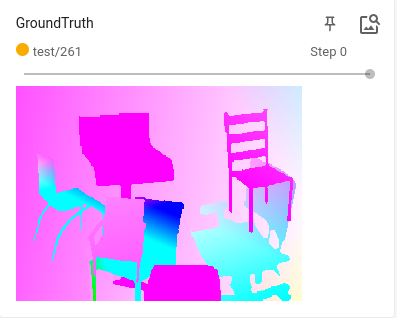

日期: 2021年9月23日 星期四        姓名:  陈勇虎   

- [ ] 修改和调试GMA模型
- [ ] 测试FlowNet模型

- [ ] 修改和调试GMA模型
- [ ] 测试FlowNet模型

- [ ] 修改和调试GMA模型

  修改后的GMA目前可以在Flying Chairs上进行训练，其他数据集上由于显卡有限，暂时无法训练，Flying Chairs目前batch-size为4.

- [ ] 测试FlowNet模型

	训练了300轮左右，模型基本收敛，EPE精度在Flying chairs上达到2.237。
  
  
  
  从可视化的结果上看，模型对遮挡等问题无法有效的处理。
  
  |  |  |
  | ------------------------------------------------------------ | ------------------------------------------------------------ |

- [ ] 继续调研光流法动态感知领域的应用算法和光流估计算法
- [ ] 阅读和学习论文源码
- [ ] 调研和收集Transformer的应用

​                

