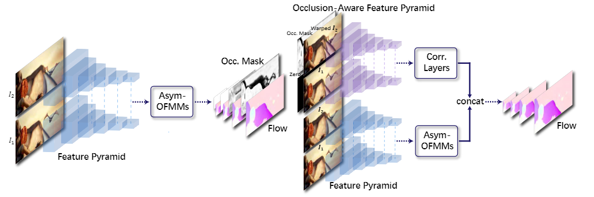

日期: 2021年9月24日 星期五        姓名:  陈勇虎   

- [ ] 修改和调试GMA模型
- [ ] 阅读论文《MaskFlownet: Asymmetric Feature Matching with Learnable Occlusion Mask》[1]

- [ ] 修改和调试GMA模型
- [ ] 阅读论文《MaskFlownet: Asymmetric Feature Matching with Learnable Occlusion Mask》

- [ ] 修改和调试GMA模型

- [ ] 阅读论文《MaskFlownet: Asymmetric Feature Matching with Learnable Occlusion Mask》

  本文提出一种可学习遮挡掩模（learnable occlusion mask）的非对称特征匹配模块，不需要任何显式的监督信息就可以预测遮挡区域、过滤特征形变带来的无效信息。目标图像通过流场形变之后，可学习遮挡掩模预测的遮挡（黑色）区域准确地过滤了重影部分的干扰信息，得到了干净的掩模图像（masked image）。在这个简单的例子中就可以看到，原始图像与目标图像并非完全对等——后者在形变之后产生了重影，需要利用掩模信息进行过滤。

  可学习遮挡掩模的非对称特征匹配模块可以轻松结合到任何已有的基础网络上，通过端到端的方式自动学习到遮挡掩模，仅仅引入可忽略不计的额外计算量就可以显著提升网络的表现。

  

  首先，非对称地引入了变形卷积（deformable convolution），即在根据当前流场对目标特征图进行形变的同时做一次额外的卷积，目的在于打破原始特征图与目标特征图的对称性。此时，网络预测的可学习遮挡掩模作用在形变后的特征图上（相乘），过滤重影现象带来的干扰信息，得到掩模特征图。最后，由于遮挡区域原本携带的信息在过滤之后有所缺失，因此需要与一个权衡项相加作为弥补，而这个权衡项，也是无监督学习到良好掩模的关键。

- [ ] 继续调研光流法动态感知领域的应用算法和光流估计算法

- [ ] 阅读和学习论文源码

- [ ] 调研和收集Transformer的应用

1. Zhao, Shengyu, Yilun Sheng, Yue Dong, Eric I-Chao Chang, and Yan Xu. 2020. “MaskFlownet: Asymmetric Feature Matching With Learnable Occlusion Mask.” In *2020 IEEE/CVF Conference on Computer Vision and Pattern Recognition (CVPR)*, 6277–86. Seattle, WA, USA: IEEE. https://doi.org/10.1109/CVPR42600.2020.00631.

   

