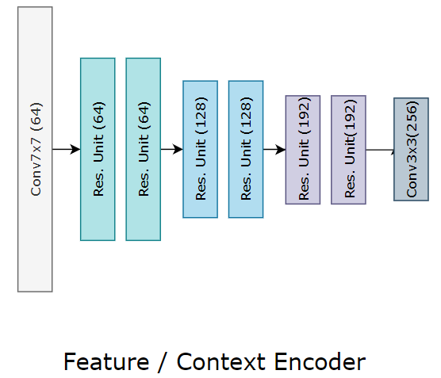
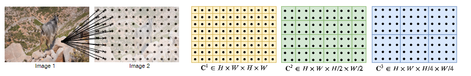

**日期**: 2021年9月28日 星期二      **姓名**: 陈勇虎 

**Plan:**

- [ ] 阅读论文《RAFT: Recurrent All-Pairs Field Transforms for Optical Flow.》[1]，学习RAFT模型

**Do**:

- [ ] 学习RAFT模型框架

**Check**:

- [ ] 给定一对连续的RGB图像$I_1,I_2$，估计流($f^1,f^2$)可以映射到对应坐标上:$(u^{\prime},v^{\prime})=(u+f^1(u),v+f^2(v))$。

  分为三个阶段:(1) 特征提取 (2) 计算视觉相似度 (3)迭代更新

  **特征提取**

  

  

  特征提取通过卷积网络实现，特征编码器对 $I_1$ 和 $I_2$ 使用并将其映射到较低的分辨率上。编码器 $g_\theta$ 将会生成 1/8 分辨率的特征图，即 $g_\theta:\mathbb{R}^{H\times W \times 3}\longmapsto \mathbb{R}^{H/8\times W/8\times D}$，这里 $D=256$ 。特征编码器由6个残差块组成，每降低 1/2 分辨率使用两个，最后将特征图的分辨率降至原图的 1/8。

  **计算视觉相似度**

  输入的图片特征$g_\theta(I_1)\in \mathbb{R}^{H\times W \times D}$ ，$g_\theta(I_2)\in \mathbb{R}^{H\times W \times D}$ ，相关体由特征矢量每一对的点积计算而来。即有:
  
  $$
  \boldsymbol{C}(g_\theta(I_1),g_\theta(I_2)) \in \mathbb{R}^{H\times W \times H \times W}，C_{i,j,k,l} = \sum_hg_\theta(I_1)_{ijh}\cdot g_\theta(I_2)_{klh}
  $$
  
  **相关金字塔**
  
  
  
  对相关体的最后两个维度以核大小为1,2,4,8对其进行(均值)池化(pooling)，从而构建了四层的金字塔，分别记为: $\{\boldsymbol{C}^1,\boldsymbol{C}^2,\boldsymbol{C}^3,\boldsymbol{C}^4\}$。因此 $\boldsymbol{C}^k$ 的维度将为 $H\times W \times H/2^k \times W / 2^k$，从而能够提供长距离位移信息和短距离的位移信息。保留前两个维度($I_1$的维度信息)，可以保留高分辨率信息，从而可以恢复小而快速移动的物体。
  
  **相关值查找**
  
  定义了一个查找符号 $L_C$ 用来从相关金字塔中获得特征图。对于给定的光流估计结果 $(\boldsymbol{f}^1,\boldsymbol{f}^2)$，对于$I_1$ 上的像素 $x = (u,v)$ ，其在 $I_2$ 上的对应位置为 $x^{\prime}=(u+f^{1}(u),v+f^{2}(v))$。定义其局部邻域：
  
  $$
  \mathcal{N}(x^{\prime})_r=\{x^{\prime}+dx|dx \in \mathbb{Z}^{2},||dx||_1\leq r\}
  $$
  
  使用 $\mathcal{N}(x^{\prime})_r$ 从相关体中索引，采样使用双线性采样。
  
  在金字塔的每一层执行查找操作，对于第k层的相关体 $\boldsymbol{C}^k$ ，使用块 $\mathcal{N}(x^{\prime}/2^k)_r$去索引。这一方式使得更低层级的邻域实际对应更大的感受野，例如对于 $k=4$ 层级，采用 $r = 4$对应于原始分辨率就是256个像素。每个层级的值将会连接到一个特征图中。 
  
  **高分辨率图像的高效计算**
  
  相关体的计算是$O(N^2) N = H\times W$ ，只需要计算一次，在M次迭代中是固定不变的。由于存在等式:
  $$
  \boldsymbol{C}_{ijkl}^m=\frac{1}{2^{2m}}\sum_{p}^{2^m}\sum_{q}^{2^m}\langle g_{i,j}^{(1)}, g_{2^mk+p,2^ml+q}^{(2)}\rangle=\langle g_{i,j}^{(1)}, \frac{1}{2^{2m}}(\sum_{p}^{2^m}\sum_{q}^{2^m}g_{2^mk+p,2^ml+q}^{(2)})\rangle
  $$
  这里$g^{(1)}=g_\theta(I_1), g^{(2)}=g_\theta(I_2)$， 因此不需要预先计算相关体，二十计算特征图的下采样结果，在每次迭代时，根据需要(即被查找的时候)再求解相关值。复杂度将会变成 $O(NM)$ 。
  
  **迭代更新**
  
  迭代更新是从一个初始化光流$f_0 = 0$优化估计一系列的光流序列$f_1,...,f_N$。在每一次迭代中，都会产生一个更新的流方向$\Delta f$，那么本次迭代后的光流估计更新为:$f_{k+1}=\Delta f + f_{k+1}$。
  
  最终将光流训练收敛到$f_k\rightarrow f^{*}$ 。

**Action**:

- [ ] 继续调研光流法动态感知领域的应用算法和光流估计算法

- [ ] 阅读和学习论文源码

- [ ] 调研和收集Transformer的应用

**Reference:**

1. Teed, Zachary, and Jia Deng. 2020. “RAFT: Recurrent All-Pairs Field Transforms for Optical Flow.” In *Computer Vision – ECCV 2020*, edited by Andrea Vedaldi, Horst Bischof, Thomas Brox, and Jan-Michael Frahm, 12347:402–19. Lecture Notes in Computer Science. Cham: Springer International Publishing. https://doi.org/10.1007/978-3-030-58536-5_24.

