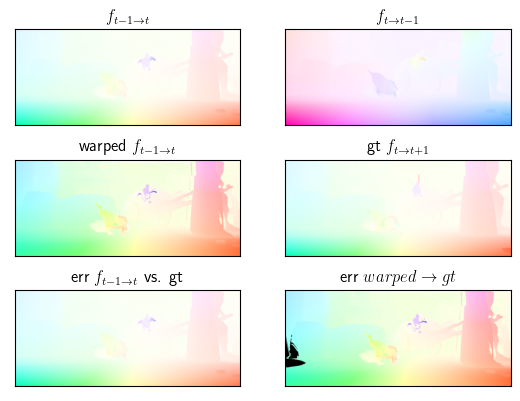
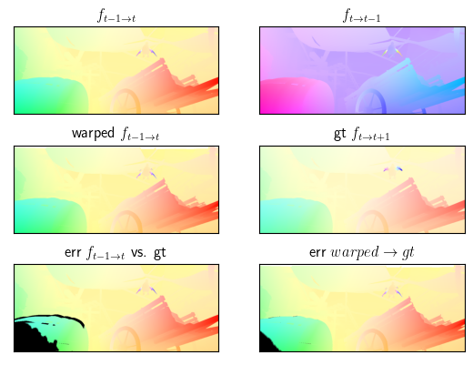

日期: 2021年9月29日 星期三       姓名:  陈勇虎   

- [ ] 测试对光流的warp对前向光流的影响

- [ ] 测试对光流的warp对前向光流的影响

- [ ] 测试对光流的warp对前向光流的影响

  从数据集中选取了连续40帧图片对应的光流，每3帧做一次实验，以其中两组实验为例。

  黑色部分代表候选光流与真值光流之间的插值。

上图中可以看出warp后光流实际上拉大了与真值间的误差，主要可能在于$f_{t-1\rightarrow t} $的场景中很多背景是近似静态。而下图中可以明显看出，在动态的环境中，反向光流对正向光流的warp可以缩小与真值之间的差距。

- [ ] 继续调研光流法动态感知领域的应用算法和光流估计算法

- [ ] 阅读和学习论文源码

- [ ] 调研和收集Transformer的应用

1. Ren, Zhile, Orazio Gallo, Deqing Sun, Ming-Hsuan Yang, Erik B. Sudderth, and Jan Kautz. 2019. “A Fusion Approach for Multi-Frame Optical Flow Estimation.” In *2019 IEEE Winter Conference on Applications of Computer Vision (WACV)*, 2077–86. Waikoloa Village, HI, USA: IEEE. https://doi.org/10.1109/WACV.2019.00225.

