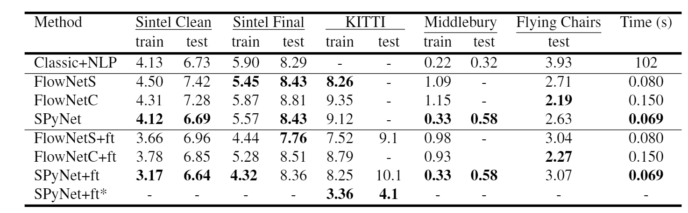
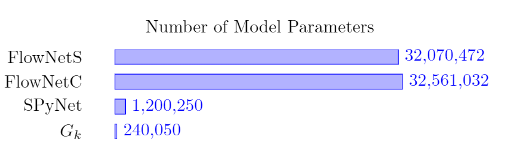

姓名:  陈勇虎

日期: 2021年9月3日 星期五

- [ ] 阅读论文《Optical Flow Estimation Using a Spatial Pyramid Network.》[1]

1. 阅读论文《Optical Flow Estimation Using a Spatial Pyramid Network.》

1. 阅读论文《Optical Flow Estimation Using a Spatial Pyramid Network.》

   ##### Spatial Pyramid Network

   使用了由粗到细的空间金字塔结构[2]，用于学习金字塔每一层上的残差流。

   ###### Spatial Sampling

   记原图像为 $I$ ，大小为 $m\times n$

   记 $d(.)$为下采样函数，可以将图像 $I$ 下采样为大小为 $m/2 \times n/2$

   记 $u(.)$ 为逆操作，即上采样函数，可以将图像 $I$ 上采样为大小为 $2m \times 2n$

   上述两个操作通过双线性插值实现，对于光临场 $V.$ 也会进行同样的重采样操作

   定义图像扭曲($warp$)操作符 $w(I,V)$，用来根据光流场 $V$ 对图像 $I$ 进行 $warp$操作，通过双线性插值实现。

   ###### Inference

   记 $\{G_0,...,G_k\}$ 为训练好的 卷积神经网络模型(covnet)，可以计算出在金字塔第 $k$ 层的残差流 $v_k$:
   $$
   v_k=G_k(I_k^1,w(I_k^2,u(V_{k-1})),u(V_{k-1}))
   $$
   卷积层 $G_k$ 计算残差流 $v_k$通过金字塔上一层的上采样流，以及在第 $k$ 层的帧 $\{I_k^1, I_k^2\}$。第二帧 $I_k^2$ 将先通过 $warp$ 操作得到 $w(I_k^2,u(V_{k-1}))$ 后再传到 $G_k$中，金字塔第 $k$ 层的流 $V_k$则如下得到：
   $$
   V_k=u(V_{k-1}) - v_k
   $$
   金字塔的最高层将流初始化为0，其余结构不难理解。

   

   上图为三层金字塔的示例，实验中作者使用的是五层的金字塔。

   ###### Training and Network Architecture

   对卷积网络 $\{G_0,...,G_k\}$ 的训练，采用的是独立且序列化的方式，通过给定的输入 $\{I_k^1,w(I_k^2,u(V_{k-1})),u(V_{k-1})\}$，在金字塔的第 $k$ 层，通过前一层上采样的光流场和目标光流场 $\hat{V}_k$ 计算残差 $\hat{v}_k$，其中 $u(V_{k-1})$ 从上一层训练好的网络获得。于是有:
   $$
   \hat{v}_k = \hat{V}_k-u(V_{k-1}).
   $$
   具体如下图所示。

   

   训练每一个网络 $G_k$， 通过最小化残差流 $v_k$ 和 $\hat{v}_k$ 间的AEE：
   $$
   \frac{1}{m_kn_k}\sum_{x,y}\sqrt{(v_k^x-\bar{v}_k^x)^2+(v_k^y-\bar{v}_k^y)^2}
   $$
   这里的$m_k,n_k$为金字塔第 $k$ 层的图像维度，$x,y$代表光流的水平和垂直分量。

   训练数据集: **Flying Chairs dataset** 和 **MPI-Sintel**

   训练了五个卷积网络: $G_0,...,G_4$

   * 分别在分辨率为 $24\times 32$, $48\times 64$,..., $384\times 512$下训练
   * 每个$G_k$有5层卷积层，每一层(除了最后一层)后都用 **RELU** 激活
   * 训练网络采用 $7\times7$的卷积核，实验验证该大小效果更好
   * 每个卷积网络$G_k$的卷积核大小依次为 $\{32,64,32,16,2\}$
   * 输入：
     1. stack($\{I_k^1,w(I_k^2,u(V_{k-1})),u(V_{k-1})\}$): 3 + 3 + 2 = 8 通道数据
     2. $I_k^1$ : RGB 图片1
     3. $w(I_k^2,u(V_{k-1}))$: warp后的RGB图片2
     4. $u(V_{k-1})$: 两通道光流场的上采样结果
   * 输出：两通道光流场 （$x,y$）
   * 初始化：训练 $G_k$ 时采用 $G_{k-1}$的参数作为初始化参数

   ##### Experiments

   **Flying Chairs**

   FlowNetS < SpyNet < FlowNetC

   Results are divided into methods trained with (+ft) and without fine tunings.

   SPyNet+ft* uses additional training data compared to FlowNet+ft

   All run times are measured on Flying Chairs and exclude image loading time.

   

   其他数据集结果见论文

   参数个数: 96% smaller than FlowNet

   

1.  继续调研光流法动态感知领域的应用算法和光流估计算法

1. Ranjan, Anurag, and Michael J. Black. 2017. “Optical Flow Estimation Using a Spatial Pyramid Network.” In *2017 IEEE Conference on Computer Vision and Pattern Recognition (CVPR)*, 2720–29. Honolulu, HI: IEEE. https://doi.org/10.1109/CVPR.2017.291.

2. E. L. Denton, S. Chintala, R. Fergus, et al. Deep generative image models using a laplacian pyramid of adversarial networks. In Advances in neural information processing systems, pages 1486–1494, 2015.

   

   

