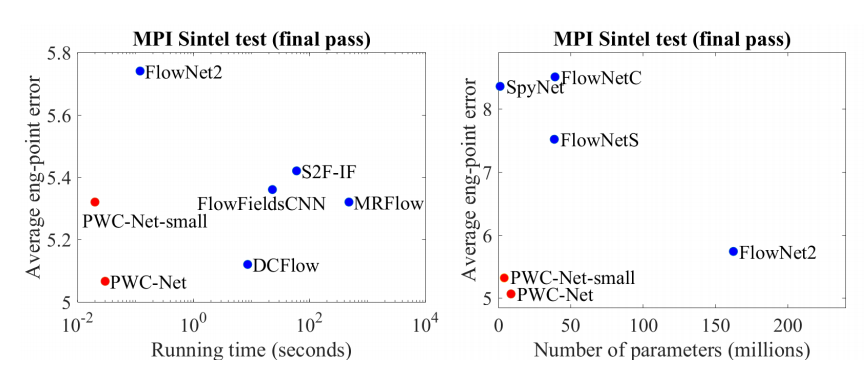
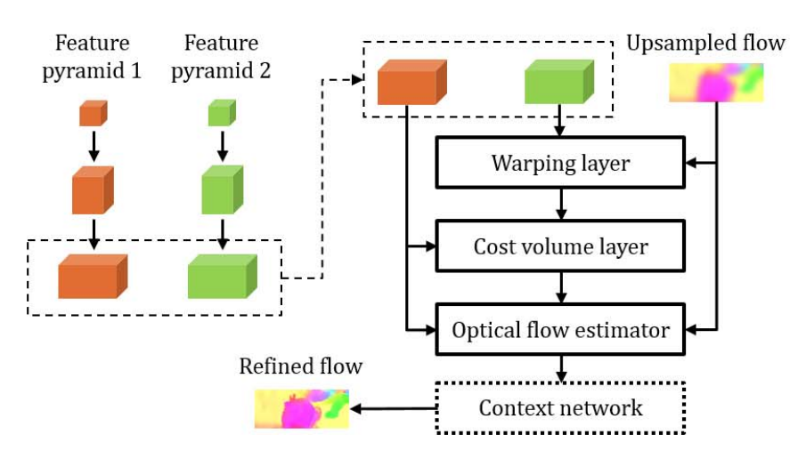

**日期**: 2021年9月6日 星期一      **姓名**: 陈勇虎 

**Plan:**

- [ ] 阅读论文《PWC-Net: CNNs for Optical Flow Using Pyramid, Warping, and Cost Volume》[1]
- [ ] 学习图像处理相关内容

**Do**:

1. 阅读论文《PWC-Net: CNNs for Optical Flow Using Pyramid, Warping, and Cost Volume》

**Check**:

1. 阅读论文《PWC-Net: CNNs for Optical Flow Using Pyramid, Warping, and Cost Volume》

   该网络基于三个简单但是由来已久的原则：金字塔式处理（pyramidal processing）；基于上一层习得的光流偏移下一层特征，逐层学习下一层细部光流（warping）；设计代价容量函数（cost volume). 尽管PWC-Net的网络尺寸比flownet2小了17倍（Flownet2需要640MB的memory footprint），也更加容易训练，却在MPI Sintel final pass 和 KITTI 2015 benchmarks表现的最好。

   

   网络结构i如下所示：

   
   
   关键点
   
   * Learned feature pyramid instead of image pyramid
   * Warping of feature maps
   * Computing a cost volume of learned feature maps (correlation)
   
   创新点：
   
   * 多尺度的训练损失函数
   * Cost Volume层的使用

**Action**:

1.  继续调研光流法动态感知领域的应用算法和光流估计算法
2.  精读PWC实现的细节和从源码角度理解

**Reference:**

1. Sun, Deqing, Xiaodong Yang, Ming-Yu Liu, and Jan Kautz. 2018. “PWC-Net: CNNs for Optical Flow Using Pyramid, Warping, and Cost Volume.” In *2018 IEEE/CVF Conference on Computer Vision and Pattern Recognition*, 8934–43. Salt Lake City, UT, USA: IEEE. https://doi.org/10.1109/CVPR.2018.00931.

   

   

