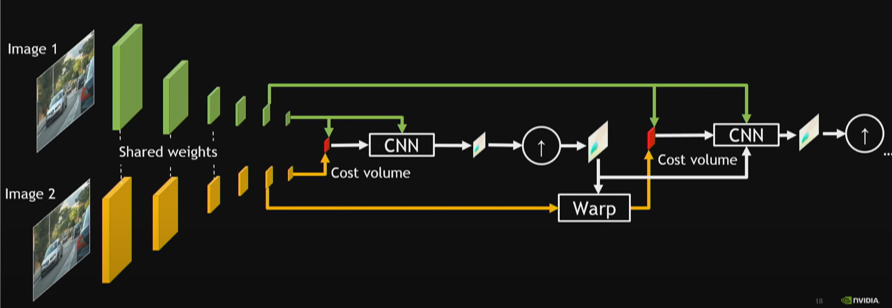
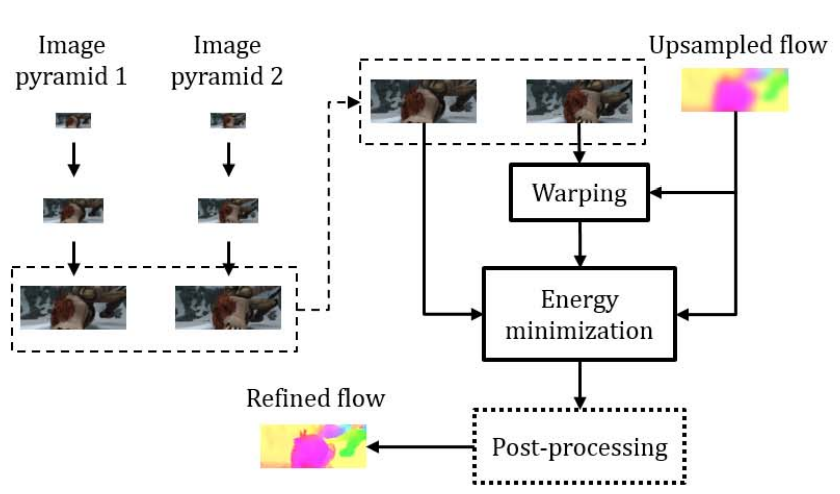

姓名:  陈勇虎

日期: 2021年9月7日 星期二

- [ ] 从汇报和代码理解论文《PWC-Net: CNNs for Optical Flow Using Pyramid, Warping, and Cost Volume》[1]

1. 理解论文《PWC-Net: CNNs for Optical Flow Using Pyramid, Warping, and Cost Volume》

1. 理解论文《PWC-Net: CNNs for Optical Flow Using Pyramid, Warping, and Cost Volume》

   

   传统的coarese-to-fine的框架中基本只引入了warping和基于变分法的方法进行光流估计，此外还有额外的后处理操作。

   

   论文中的核心就在于引入的cost volume layer。
   $$
   cv^{l}(x_1,x_2)=\frac{1}{N}(c_1^l(x_1))^Tc_w^l(x_2)
   $$
   在计算cost volume的时候，限定了像素搜索的范围。
   $$
   |x_1-x_2|_\infty \leq d
   $$
   最后生成的3D cost volume的维度将为$d^2\times H^l \times W^l$

1.  继续调研光流法动态感知领域的应用算法和光流估计算法

1. Sun, Deqing, Xiaodong Yang, Ming-Yu Liu, and Jan Kautz. 2018. “PWC-Net: CNNs for Optical Flow Using Pyramid, Warping, and Cost Volume.” In *2018 IEEE/CVF Conference on Computer Vision and Pattern Recognition*, 8934–43. Salt Lake City, UT, USA: IEEE. https://doi.org/10.1109/CVPR.2018.00931.

   

   

