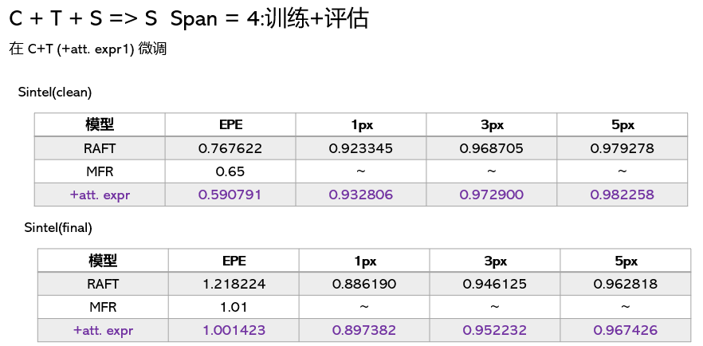
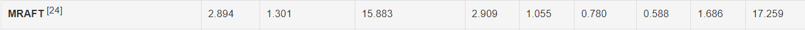
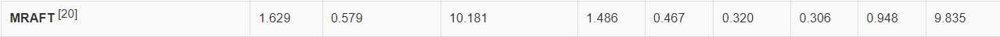

**日期**: 2022年1月5日 星期三      **姓名**: 陈勇虎 

**Plan:**

- [ ] warm start

**Do**:

- [ ] warm start

**Check**:

- [ ] 实现warm start

- [ ] C+T+S 跑完了一组实验

  

- [ ] 提交网站获取测试集性能排名

  final数据集目前排名24.

  

  clean数据集目前排名20.	
  

​		网站上RAFT和MFR是在C+T+S+K+H五个数据集下的训练结果，后面完成C+T+K后再做C+T+S+K+H的实验。

**Action**:

- [ ] 学习各种attention

- [ ] local attention vs multi-head attention

  

