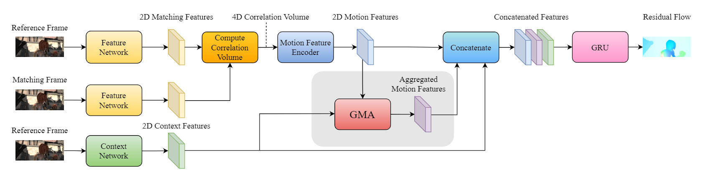
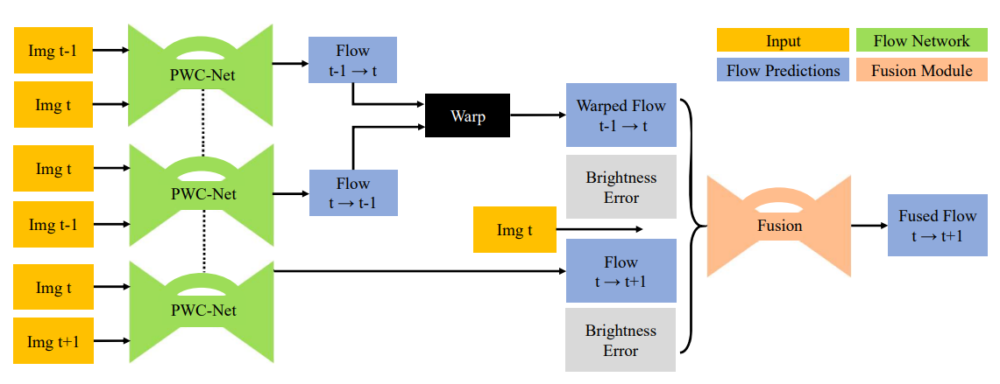
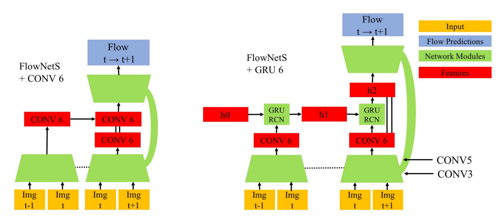
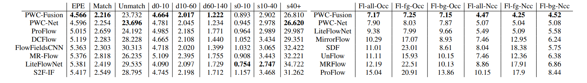
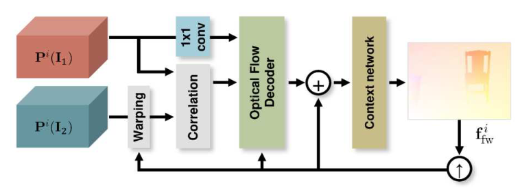
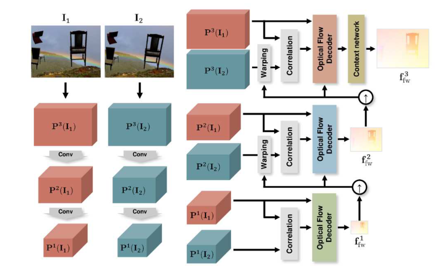
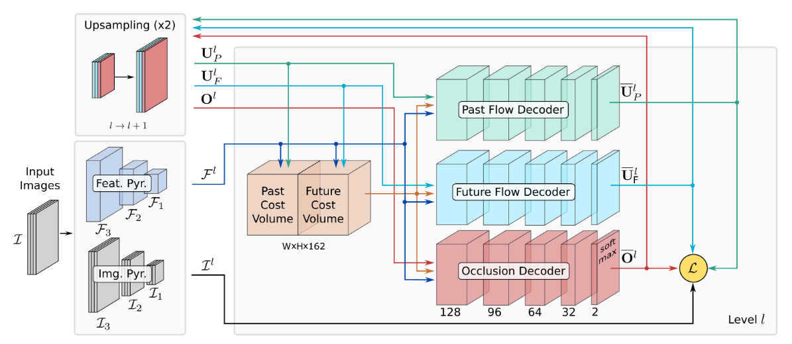

# Optical Flow

## Two-Frame Fashion

### RAFT（ECCV 2020 best)

**Paper: RAFT: Recurrent All-Pairs Field Transforms for Optical Flow**

[[笔记链接](./PapersNotes/RAFT(ECCV 2020 Best).md)]

### GMA(ICCV 2021)

**Paper: Learning to Estimate Hidden Motions with Global Motion Aggregation**

**Occlusions**:一个被遮挡的点是在参考帧中成像但不在下一帧中的一个点，同时包括移出帧的点。 以前的工作依赖于 CNN 来学习遮挡，或者需要多个帧来使用时间平滑来推理遮挡。 在本文中，通过对图像自相似性进行建模，可以在两帧情况下更好地解决遮挡问题。 引入了全局运动聚合模块，这是一种基于transformer的方法，用于查找第一张图像中像素之间的远程依赖关系，并对相应的运动特征执行全局聚合。 

**Challenges: large motions, motion and defocus blur, featureless regions。**

定义Occlusions的含义: 遮挡点被定义为在参考帧中成像但在匹配帧中不可见的 3D 点。 这个定义结合了几种不同的场景，例如查询点移动到框架外或在另一个对象（或自身）后面，或者另一个对象在主动意义上移动到查询点前面。 

cost volume用于为像素的每个潜在位移提供匹配成本，然而，外观特征的相关性无法为学习遮挡区域的运动提供有意义的指导。 大多数现有方法在 MRF 中使用平滑度项来插值遮挡运动或使用 CNN 直接学习相邻关系，希望学习基于相邻像素估计遮挡运动。

 引入了全局运动聚合 (GMA) 模块，首先根据参考帧的自相似性计算注意力矩阵，然后使用该注意力矩阵来聚合运动特征。使用这些全局聚合的运动特征来增强成功的RAFT框架。

**Occlusions in optical flow:** 违反亮度恒定性约束，对光流估计提出了关键挑战。 大多数传统的光流算法将遮挡视为异常值，因此开发和优化鲁棒的目标函数。 在光流的持续优化中，Brox 等人使用 L1 范数是因为它对由遮挡或大亮度变化引起的异常值具有鲁棒性。 扎克等人增加了全变分正则化并提出了一种有效的数值方案来优化能量泛函。 这个配方后来被 Wedel 等人改进。后来的工作引入了额外的鲁棒优化项，包括 Charbonnier 势 和 Lorentzian 势 。 

最近，离散优化方法，特别是马尔可夫随机场（MRF)，已被用于估计光流。 这些算法首先使用鲁棒的截断数据项分别估计前向和后向流。 然后他们进行前向-后向一致性检查以确定被遮挡的区域。 最后，作为后处理步骤，他们使用插值方法来填充被遮挡区域的光流。 

其他工作将遮挡估计作为联合目标与光流估计结合在一起。 阿尔瓦雷斯等人使用前向-后向一致性作为优化目标，从而估计时间对称的光流。 除了前向-后向一致性外，MirrorFlow在能量函数中结合了遮挡 - 遮挡对称性并实现了性能改进。 由于遮挡是由 3D 运动引起的，其他工作明确地将局部深度关系建模为层并解释遮挡。 

本文没有使用显式遮挡推理来重载损失函数。 相反，采用了一种学习方法，类似于其他有监督的深度光流学习方法。目标不是明确地估计遮挡图，而是提高遮挡区域的光流精度。采用隐式方法来全局聚合运动特征，这提供了额外信息来正确预测遮挡区域的流量。与局部插值方法相反，该方法可以被认为是一种非局部插值方法。在深度学习中，遮挡问题已经在无监督学习设置中得到解决，然而，现有的监督学习方法都依赖于卷积来插入遮挡区域，这很容易导致更严重的闭塞失败。

**Self-attention and Transformers:** 这是第一个使用注意力的思想来解决光流问题的工作。与 Transformer不同的是，本文中不使用 self-attention，自注意力是指来自相同特征的查询、键和值向量。 在这里的例子中，查询和关键向量来自对图像外观建模的上下文特征，而值向量来自运动特征，这是相关体(cost correlation volume)的编码。

##  MFF（Multi-Frame FLow）

### PWCNet Fusion (WACV 2019)

**Paper : A Fusion Approach for Multi-Frame Optical Flow Estimation**

**Architecture of the proposed fusion approach for three-frame optical flow estimation**

Key ideas:

- If we are given $f_{t-1\to t}$ and $f_{t\to t-1}$, and assume constant velocity of movement, then an estimate of $f_{t\to t+1}$ can be formed by backward warping $f_{t-1\to t}$ with $f_{t\to t-1}$.

- With three frames available, we can plug-in any two-frame optical flow estimation solution (PWCNet in this case) to obtain $f_{t-1 \to t}$, $f_{t\to t+1}$ and $f_{t \to t-1}$.

- A fusion network (similar to the one used in the last stage of FlowNet 2.0) can be used to fuse together and.

  - Note that would be identical to if
    * (a) velocity is constant 
    * (b) three optical flow estimations are correct
    * (c) there are no occlusions
  
  	Brightness constancy errors of the two flow maps together with the source frame $I_t$ are fed into the fusion network to provide additional info.

**Why multi-frame may perform better than 2-frame solutions:**

- temporal smoothness leads to additional regularization.

- longer time sequences may help in ambiguous situations such as occluded regions.

本文提出了基于深度学习的方法框架，分别是 **FlowNetS++** , **FlowNetS + GRU**，**PWC-Net + GRU**模型。从模型上看，框架中将会把从前几个图片对中得到的信息带入到后面的帧中进行处理。循环神经网络在处理时序信号上的优势也正是应用它的关键所在，同时，GRU模型较小，使用GRU从视频流中捕获特征也更有优势。

在 **PWC-Net + GRU**结构中，是通过在GRU-RCN的不同层级上输入编码后的特征，在不同的层级上解码特征和学习特征表示。

论文采用了PWC-Net模型中的训练损失函数:
$$
L(\Theta)=\sum_{l = l_0}^{L}\alpha_l\sum_{x}(|w_\Theta^l(x)-w_{GT}^l(x)|+\epsilon)^q + \gamma||\Theta||_2^2
$$
在后续的消融分析上，作者通过实验也发现，使用三帧图片的确可以带来更好的数据结果，而且在和两帧方法相比之后，该文提出的融合网络方法也达到了更好的效果。

### IRR-PWCNet (CVPR 2019)

**Paper : Iterative Residual Refinement for Joint Optical Flow and Occlusion Estimation**

Key ideas

- Take the output from a previous pass through the network as input and iteratively refine it by only using a single network block with shared weights, which allows the network to residually refine the previous estimate.
- For PWCNet, the decoder module at different pyramid level is achieved using a 1x1 convolution before feeding the source feature map to the optical flow estimator/decoder.
- Joint occlusion and bidirectional optical flow estimation leads to further performance enhancement.

在结构上，与下图中的PWC-Net结构相比，文中提出的IRR模型与原始的PWC-Net的不同之处在于，PWC-Net是在不同的尺度上做各自的光流估计，然而IRR模型确实在原始的空间分辨率上，因此，模型中可以采用一个共享权重的解码器，并且可以在不同层级上使用。

在训练的损失函数上，文中对前向和后向光流使用了正则项：
$$
l_{\text {flow }}^{i}=\frac{1}{2} \sum\left(\left\|\mathbf{f}_{\mathrm{fw}}^{i}-\mathbf{f}_{\mathrm{fw}, \mathrm{GT}}\right\|_{2}+\left\|\mathbf{f}_{\mathrm{bw}}^{i}-\mathbf{f}_{\mathrm{bw}, \mathrm{GT}}\right\|_{2}\right)
$$
在occlusion map上使用了加权的二进制交叉熵函数：
$$
\begin{aligned}
    l_{\mathrm{occ}}^{i}=-\frac{1}{2} \sum &\left(w_{1}^{i} o_{1}^{i} \log o_{1, \mathrm{GT}}+\bar{w}_{1}^{i}\left(1-o_{1}^{i}\right) \log \left(1-o_{1, \mathrm{GT}}\right)\right.\\
    &\left.+w_{2}^{i} o_{2}^{i} \log o_{2, \mathrm{GT}}+\bar{w}_{2}^{i}\left(1-o_{2}^{i}\right) \log \left(1-o_{2, \mathrm{GT}}\right)\right)
\end{aligned}
$$
这里面是考虑到了预测的数量和真实的标签，因此设置了权重$w_1^i=\frac{H\cdot W}{\sum o_1^i + \sum o_{1,GT}}$ 和 $\bar{w}_1^i=\frac{H\cdot W}{\sum (1 - o_1^i) + \sum (1 - o_{1,GT})}$ 。

最终的损失函数是两者的加权和，针对FlowNet和PWC-Net，表达式分别为：
$$
l_{\text {FlowNet }}=\frac{1}{N} \sum_{i=1}^{N} \sum_{s=s_{0}}^{S} \alpha_{s}\left(l_{\text {flow }}^{i, s}+\lambda \cdot l_{\mathrm{occ}}^{i, s}\right)
$$

$$
l_{\text {PWC-Net }}=\frac{1}{N} \sum_{i=1}^{N} \alpha_{i}\left(l_{\text {flow }}^{i}+\lambda \cdot l_{\mathrm{occ}}^{i}\right)
$$

### UMFO

**Paper: Unsupervised Learning of Multi-Frame Optical Flow and Occlusions**

论文提出的模型是对PWC-Net模型进行了修改，同时输入是三帧图片，PWC中对两帧图片的特征金字塔做cost volume(第二帧的特征需要经过一次warping)，本文提出的模型是对$\mathcal{F}^p$ 和 $\mathcal{F}^f$分别计算cost volume，最后将两个cost volume进行堆叠，传入后面的解码器中。

在损失函数方面，提出了如下的损失函数：
$$
\mathcal{L}=\mathcal{L}_P+\mathcal{L}_{S_F}+\mathcal{L}_{S_P}+\mathcal{L}_{S_O}+\mathcal{L}_{CV}+\mathcal{L}_{O}
$$
论文引入了$\boldsymbol{O}\in[0,1]^{W\times H\times 2}$用来衡量photometric losss，并且使用softmax保持$||\boldsymbol{O}(p)||_1=1$ 。

损失函数中各项表达式依次如下:
$$
\begin{aligned}
\mathcal{L}_{P} &=\sum_{\mathbf{p} \in \Omega} \mathbf{O}^{(2)}(\mathbf{p}) \cdot \delta\left(\hat{\mathbf{I}}_{P}\left(\mathbf{p}+\mathbf{u}_{P}(\mathbf{p})\right), \mathbf{I}_{R}(\mathbf{p})\right) \\
&+\sum_{\mathbf{p} \in \Omega} \mathbf{O}^{(1)}(\mathbf{p}) \cdot \delta\left(\hat{\mathbf{I}}_{F}\left(\mathbf{p}+\mathbf{u}_{F}(\mathbf{p})\right), \mathbf{I}_{R}(\mathbf{p})\right)
\end{aligned}
$$

$$
\mathcal{L}_{S_{P}}=\sum_{\mathbf{p} \in \Omega} \xi\left(\nabla_{x} \mathbf{I}_{R}(\mathbf{p})\right) \rho\left(\nabla_{x} \mathbf{U}_{P}(\mathbf{p})\right)+\sum_{\mathbf{p} \in \Omega} \xi\left(\nabla_{y} \mathbf{I}_{R}(\mathbf{p})\right) \rho\left(\nabla_{y} \mathbf{U}_{P}(\mathbf{p})\right)
$$

$$
\mathcal{L}_{S_{O}}=\sum_{\mathbf{p} \in \Omega} \xi\left(\nabla_{x} \mathbf{I}_{R}(\mathbf{p})\right)\left\|\nabla_{x} \mathbf{O}(\mathbf{p})\right\|^{2}+\sum_{\mathbf{p} \in \Omega} \xi\left(\nabla_{y} \mathbf{I}_{R}(\mathbf{p})\right)\left\|\nabla_{y} \mathbf{O}(\mathbf{p})\right\|^{2}
$$

$$
\mathcal{L}_{C V}=\sum_{\mathbf{p} \in \Omega} \rho\left(\mathbf{U}_{P}(\mathbf{p})+\mathbf{U}_{F}(\mathbf{p})\right)
$$

$$
\mathcal{L}_{O}=-\sum_{\mathbf{p} \in \Omega} \mathbf{O}^{(1)}(\mathbf{p}) \cdot \mathbf{O}^{(2)}(\mathbf{p})
$$

### STaRFlow（ICPR 2020）

