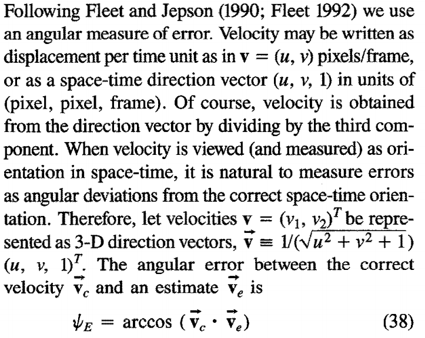
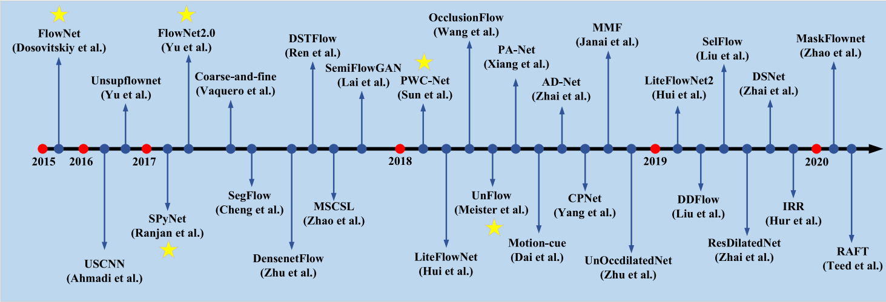
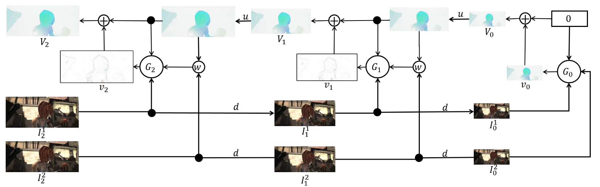
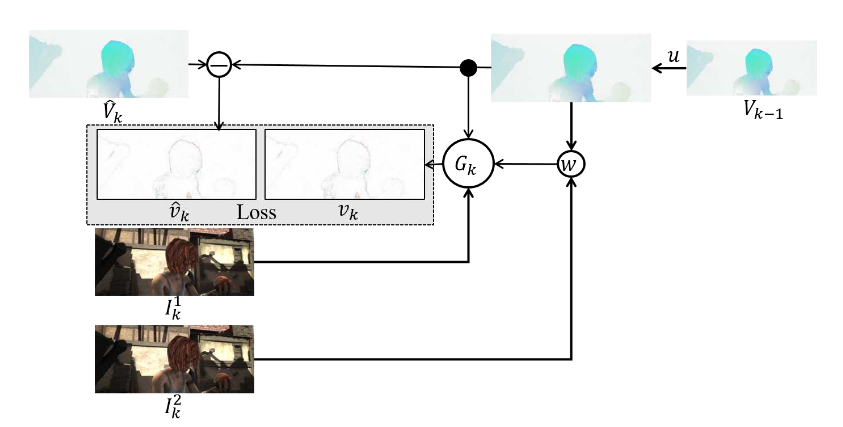
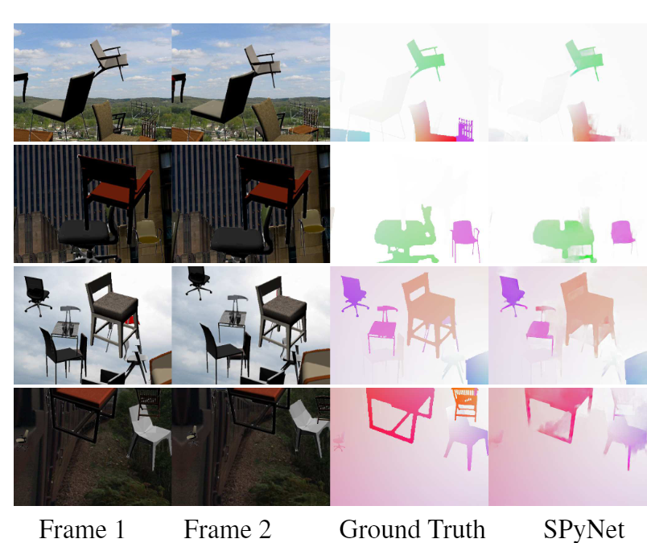

[toc]

# Metrics

基础的评价指标有 **(EndPoint Error)EPE**, 是估计值和真值之间的欧氏距离。

除此以外还有几个常用的指标：

1. **Average Angular Error(AAE)**
2. **Average Endpoint  Error(AEE)**
3. **Root-Mean-Square Error(RMSE)**
4. **The percentage of outliers averaged over all pixels(Fl-all)**

$(u_{*},v_{*})$ = ground truth flow $(u,v)$ = estimated flow

于是有:

|              Metric              |                           Formula                            |
| :------------------------------: | :----------------------------------------------------------: |
|  **Average Angular Error(AAE)**  | $1/HW\sum\arccos\left[(u_{*}u + v_{*}v + 1) / \sqrt{(u_{*}^{2} + v_{*}^{2} + 1)(u^2 + v^2 + 1)})\right]$ |
| **Average Endpoint  Error(AEE)** |           $1/HW\sum\sqrt{(u_{*}-u)^2+(v_{*}-v)^2}$           |
| **Root-Mean-Square Error(RMSE)** |      $\sqrt{1/HW\sum_{x,y}(I_{warped}(x,y)-I(x,y))^2}$       |

假设像素集合 $B_1$ 满足$EPE > 5$, 满足下式的像素集合为 $B_2$。
$$
\frac{EPE}{\sqrt{(u_{*} + v_{*})^2+10^{-5}}} \gt 5\%
$$
定义劣点集合 $B$ 为 $B_1 \cup B_2$，记 $N$ 为 坏点的个数。于是 **Fl-all** 可以定义为
$$
Fl-all = \frac{N}{HW} \times 100 \%
$$
其中 **AE** 的理解可以参考论文[^1], 光流表示为 $(u,v) = (u,v,1)$，**后者的单位为(pixels，pixels，frame)**



# Development

《Optical Flow and Scene Flow Estimation: A Survey》 [^2]中给出了 **data-driven**和 **hybrid-driven**的光流估计网络，发展如下所示，具体可参考论文内容。



## Classification

即为 **knowledge-driven**, **data-driven** 和 **hybrid-driven**三种，不过根据性能，后两种将成为未来的主流。

### U-Net


### Spatial pyramid network

#### SPynet

解读链接（相同内容，只能简单参考）:

1.https://blog.csdn.net/Bruce_0712/article/details/108659089

2.https://www.zybuluo.com/rianusr/note/1471754#0-%E5%85%89%E6%B5%81%E7%AE%80%E4%BB%8B



Key idea:

- Incorporate classic `coarse-to-fine` concepts into CNN network and update residual flow over mulitple pyramid levels (5 image pyramid levels are used). Networks at different levels have separate parameters.

Achieves comparable performance to FlowNet with 96% less number of parameters.

##### Spatial Pyramid Network

使用了由粗到细的空间金字塔结构[^3]，用于学习金字塔每一层上的残差流。

###### Spatial Sampling

记原图像为 $I$ ，大小为 $m\times n$

记 $d(.)$为下采样函数，可以将图像 $I$ 下采样为大小为 $m/2 \times n/2$

记 $u(.)$ 为逆操作，即上采样函数，可以将图像 $I$ 上采样为大小为 $2m \times 2n$

上述两个操作通过双线性插值实现，对于光临场 $V.$ 也会进行同样的重采样操作

定义图像扭曲($warp$)操作符 $w(I,V)$，用来根据光流场 $V$ 对图像 $I$ 进行 $warp$操作，通过双线性插值实现。

###### Inference

记 $\{G_0,...,G_k\}$ 为训练好的 卷积神经网络模型(covnet)，可以计算出在金字塔第 $k$ 层的残差流 $v_k$:
$$
v_k=G_k(I_k^1,w(I_k^2,u(V_{k-1})),u(V_{k-1}))
$$
卷积层 $G_k$ 计算残差流 $v_k$通过金字塔上一层的上采样流，以及在第 $k$ 层的帧 $\{I_k^1, I_k^2\}$。第二帧 $I_k^2$ 将先通过 $warp$ 操作得到 $w(I_k^2,u(V_{k-1}))$ 后再传到 $G_k$中，金字塔第 $k$ 层的流 $V_k$则如下得到：
$$
V_k=u(V_{k-1}) - v_k
$$
金字塔的最高层将流初始化为0，其余结构不难理解。


上图为三层金字塔的示例，实验中作者使用的是五层的金字塔。

###### Training and Network Architecture

对卷积网络 $\{G_0,...,G_k\}$ 的训练，采用的是独立且序列化的方式，通过给定的输入 $\{I_k^1,w(I_k^2,u(V_{k-1})),u(V_{k-1})\}$，在金字塔的第 $k$ 层，通过前一层上采样的光流场和目标光流场 $\hat{V}_k$ 计算残差 $\hat{v}_k$，其中 $u(V_{k-1})$ 从上一层训练好的网络获得。于是有:
$$
\hat{v}_k = \hat{V}_k-u(V_{k-1}).
$$
具体如下图所示。



训练每一个网络 $G_k$， 通过最小化残差流 $v_k$ 和 $\hat{v}_k$ 间的AEE：
$$
\frac{1}{m_kn_k}\sum_{x,y}\sqrt{(v_k^x-\bar{v}_k^x)^2+(v_k^y-\bar{v}_k^y)^2}
$$
这里的$m_k,n_k$为金字塔第 $k$ 层的图像维度，$x,y$代表光流的水平和垂直分量。

训练数据集: **Flying Chairs dataset** 和 **MPI-Sintel**

训练了五个卷积网络: $G_0,...,G_4$

* 分别在分辨率为 $24\times 32$, $48\times 64$,..., $384\times 512$下训练
* 每个$G_k$有5层卷积层，每一层(除了最后一层)后都用 **RELU** 激活
* 训练网络采用 $7\times7$的卷积核，实验验证该大小效果更好
* 每个卷积网络$G_k$的卷积核大小依次为 $\{32,64,32,16,2\}$
* 输入：
  1. stack($\{I_k^1,w(I_k^2,u(V_{k-1})),u(V_{k-1})\}$): 3 + 3 + 2 = 8 通道数据
  2. $I_k^1$ : RGB 图片1
  3. $w(I_k^2,u(V_{k-1}))$: warp后的RGB图片2
  4. $u(V_{k-1})$: 两通道光流场的上采样结果
* 输出：两通道光流场 （$x,y$）
* 初始化：训练 $G_k$ 时采用 $G_{k-1}$的参数作为初始化参数

数据增强:

* scale
* rotation
* crop
* additive Gaussian noise
* color jitter：additive brightness，contrast，saturation from Gaussian
* normalize: using a mean and standard deviation computed from a large sample of ImageNet

训练细节:

* Adam $\beta_1 = 0.9, \beta_2=0.999$
* batch_size = 32  iterations = 4000 
* learning rate
  * 1e-4 for first 60 epochs
  * 1e-5 until the network converge
* $G_0$ for 3days; $\{G_1,G_2,G_3,G_4\}$ for one day 

网络结构代码角度

```py
class Network(torch.nn.Module):
    def __init__(self):
        super(Network, self).__init__()
        class Preprocess(torch.nn.Module):
            def __init__(self):
                super(Preprocess, self).__init__()
            # end
            def forward(self, tensorInput):
                tensorBlue = (tensorInput[:, 0:1, :, :] - 0.406) / 0.225
                tensorGreen = (tensorInput[:, 1:2, :, :] - 0.456) / 0.224
                tensorRed = (tensorInput[:, 2:3, :, :] - 0.485) / 0.229
                return torch.cat([ tensorRed, tensorGreen, tensorBlue ], 1)
            # end
        # end
        class Basic(torch.nn.Module):
            def __init__(self, intLevel):
                super(Basic, self).__init__()
                self.moduleBasic = torch.nn.Sequential(
            torch.nn.Conv2d(in_channels=8, out_channels=32, kernel_size=7, stride=1, padding=3),
            torch.nn.ReLU(inplace=False),
            torch.nn.Conv2d(in_channels=32, out_channels=64, kernel_size=7, stride=1, padding=3),
            torch.nn.ReLU(inplace=False),
            torch.nn.Conv2d(in_channels=64, out_channels=32, kernel_size=7, stride=1, padding=3),
            torch.nn.ReLU(inplace=False),
            torch.nn.Conv2d(in_channels=32, out_channels=16, kernel_size=7, stride=1, padding=3),
            torch.nn.ReLU(inplace=False),
            torch.nn.Conv2d(in_channels=16, out_channels=2, kernel_size=7, stride=1, padding=3)
                )
            # end
            def forward(self, tensorInput):
                return self.moduleBasic(tensorInput)
            # end
        # end
        self.modulePreprocess = Preprocess()   ### 归一化处理
        # 构建{G0, …… , Gk}
        self.moduleBasic = torch.nn.ModuleList([ Basic(intLevel) for intLevel in range(6) ])
```

##### Experiments

**Flying Chairs**

FlowNetS < SpyNet < FlowNetC

1. Visualization of opeical flow estimates



2. Comparsion: AEE

   Results are divided into methods trained with (+ft) and without fine tunings.

   SPyNet+ft* uses additional training data compared to FlowNet+ft

   All run times are measured on Flying Chairs and exclude image loading time.


其他数据集结果见论文

参数个数: 96% smaller than FlowNet


其他的实验结果和分析论文中有详细的描述.

#### PWC-Net


# usefule links etc.

1. https://yyang768osu.github.io/posts/2020/06/optical_flow/
2. 

[^1]:Barron, J.L., Fleet, D.J. & Beauchemin, S.S. Performance of optical flow techniques. *Int J Comput Vision* **12,** 43–77 (1994). https://doi.org/10.1007/BF01420984
[^2]:Zhai, Mingliang, Xuezhi Xiang, Ning Lv, and Xiangdong Kong. 2021. “Optical Flow and Scene Flow Estimation: A Survey.” *Pattern Recognition* 114 (June): 107861. https://doi.org/10.1016/j.patcog.2021.107861.
[^3]: E. L. Denton, S. Chintala, R. Fergus, et al. Deep generative image models using a laplacian pyramid of adversarial networks. In Advances in neural information processing systems, pages 1486–1494, 2015.

