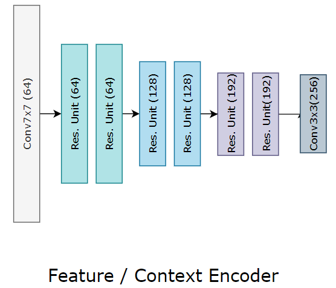
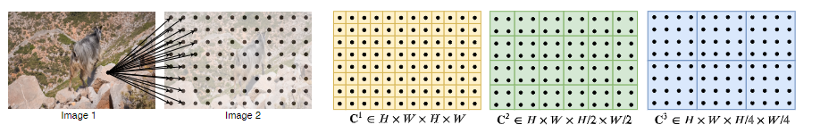

# RAFT（ECCV 2020 best)

**Paper: RAFT: Recurrent All-Pairs Field Transforms for Optical Flow**

## 概述

RAFT 提取每个像素的特征，为所有像素对构建多尺度 4D 相关体(correlation volume)，并通过对相关体执行查找,并通过循环单元迭代更新光流场。 

**Challenges：fast-moving objects, occlusions, motion blur, and textureless surfaces.**

数据项：相似图像区域对齐；正则项：运动合理性先验。

RAFT: SOTA, strong generalization, high efficiency.

RAFT三个主要部分:

* 一个特征编码器，为每个像素提取一个特征向量

* 一个相关层，为所有像素对产生 4D 相关体(correlation volume)，随后池化以产生较低分辨率的体积

* 一个循环的基于 GRU 的更新算子(update operator)，它从相关体中检索值并迭代更新初始化为零的流场。 

结构如上图所示，RAFT的 3 个主要组件的详细描述:

1. 从两个输入图像中提取每像素特征的特征编码器，以及仅从 $I_1$ 中提取特征的上下文编码器
2. 相关层，通过取所有特征向量对的内积构造一个4D的W × H × W × H 相关体。 4D 体积的最后 2 个维度在多个尺度上汇集以构建一组多尺度体积
3. 一个更新算子，它通过使用当前的估计光流从相关体集合中查找值来循环更新光流。 

RAFT 架构受到传统的基于优化的方法的启发。 特征编码器提取每个像素的特征，相关层计算像素之间的视觉相似度，更新运算符模仿迭代优化算法的步骤。 但与传统方法不同，特征和运动先验是学习得到的——分别由特征编码器和更新算子学习。

## 相关工作

**相关工作(重要)，需要详读其中涉及的几篇论文。**

* **Optical Flow vs Energy minimization**
* **Direct Flow Prediction**
* **Iterative Refinement**
* **Learning to Optimize**

## 方法

给定一对连续的RGB图像$I_1,I_2$，估计流($f^1,f^2$)可以映射到对应的坐标上:$(u^{\prime},v^{\prime})=(u+f^1(u),v+f^2(v))$。

分为三个阶段:(1) 特征提取 (2) 计算视觉相似度 (3)迭代更新

### 特征提取

特征提取通过卷积网络实现，特征编码器对 $I_1$ 和 $I_2$ 使用并将其映射到较低的分辨率上。编码器 $g_\theta$ 将会生成 1/8 分辨率的特征图，即 $g_\theta:\mathbb{R}^{H\times W \times 3}\longmapsto \mathbb{R}^{H/8\times W/8\times D}$，这里 $D=256$ 。特征编码器由6个残差块组成，每降低 1/2 分辨率使用两个，最后将特征图的分辨率降至原图的 1/8。

### 计算视觉相似度

输入的图片特征$g_\theta(I_1)\in \mathbb{R}^{H\times W \times D}$ ，$g_\theta(I_2)\in \mathbb{R}^{H\times W \times D}$ ，相关体由特征矢量每一对的点积计算而来。即有:
$$
\boldsymbol{C}(g_\theta(I_1),g_\theta(I_2)) \in \mathbb{R}^{H\times W \times H \times W}，C_{i,j,k,l} = \sum_hg_\theta(I_1)_{ijh}\cdot g_\theta(I_2)_{klh}
$$

#### 相关金字塔

对相关体的最后两个维度以核大小为1,2,4,8对其进行(均值)池化(pooling)，从而构建了四层的金字塔，分别记为: $\{\boldsymbol{C}^1,\boldsymbol{C}^2,\boldsymbol{C}^3,\boldsymbol{C}^4\}$。因此 $\boldsymbol{C}^k$ 的维度将为 $H\times W \times H/2^k \times W / 2^k$，从而能够提供长距离位移信息和短距离的位移信息。保留前两个维度($I_1$的维度信息)，可以保留高分辨率信息，从而可以恢复小而快速移动的物体。

#### 相关值查找

定义了一个查找符号 $L_C$ 用来从相关金字塔中获得特征图。对于给定的光流估计结果 $(\boldsymbol{f}^1,\boldsymbol{f}^2)$，对于$I_1$ 上的像素 $x = (u,v)$ ，其在 $I_2$ 上的对应位置为 $x^{\prime}=(u+f^{1}(u),v+f^{2}(v))$。定义其局部邻域：

$$
\mathcal{N}(x^{\prime})_r=\{x^{\prime}+dx|dx \in \mathbb{Z}^{2},||dx||_1\leq r\}
$$

使用 $\mathcal{N}(x^{\prime})_r$ 从相关体中索引，采样使用双线性采样。

在金字塔的每一层执行查找操作，对于第k层的相关体 $\boldsymbol{C}^k$ ，使用块 $\mathcal{N}(x^{\prime}/2^k)_r$去索引。这一方式使得更低层级的邻域实际对应更大的感受野，例如对于 $k=4$ 层级，采用 $r = 4$对应于原始分辨率就是256个像素。每个层级的值将会连接到一个特征图中。 

#### 高分辨率图像的高效计算

相关体的计算是$O(N^2) N = H\times W$ ，只需要计算一次，在M次迭代中是固定不变的。由于存在等式:
$$
\boldsymbol{C}_{ijkl}^m=\frac{1}{2^{2m}}\sum_{p}^{2^m}\sum_{q}^{2^m}\langle g_{i,j}^{(1)}, g_{2^mk+p,2^ml+q}^{(2)}\rangle=\langle g_{i,j}^{(1)}, \frac{1}{2^{2m}}(\sum_{p}^{2^m}\sum_{q}^{2^m}g_{2^mk+p,2^ml+q}^{(2)})\rangle
$$
这里$g^{(1)}=g_\theta(I_1), g^{(2)}=g_\theta(I_2)$， 因此不需要预先计算相关体，二十计算特征图的下采样结果，在每次迭代时，根据需要(即被查找的时候)再求解相关值。复杂度将会变成 $O(NM)$ 。

### 迭代更新

迭代更新是从一个初始化光流$f_0 = 0$优化估计一系列的光流序列$f_1,...,f_N$。在每一次迭代中，都会产生一个更新的流方向$\Delta f$，那么本次迭代后的光流估计更新为:$f_{k+1}=\Delta f + f_{k+1}$。

最终将光流训练收敛到$f_k\rightarrow f^{*}$ 。

#### 初始化

#### 输入

#### 更新

全连接用卷积代替，构成ConvGRU

#### 流预测

#### 上采样

以上内容不做赘述

### 监督

预测光流$f_1,\cdots,f_n$和$GT$之间的 $L_1$ 距离，不同阶段赋予不同权重。
$$
\mathcal{L}=\sum_{i=1}^{N}\gamma^{i-N}||f_{gt}-f_i||_1
$$
本文中的 $\gamma=0.8$。

## 实验和消融分析

略

## 参考分享

1. [技术刘的论文笔记](http://www.liuxiao.org/2020/10/%E8%AE%BA%E6%96%87%E7%AC%94%E8%AE%B0%EF%BC%9Araft-recurrent-all-pairs-field-transforms-for-optical-flow/)
2. [Presentation on RAFT: Recurrent All-Pairs Field Transforms for Optical Flow.](https://www.youtube.com/watch?v=r3ZtW30exoo)
3. [ECCV 2020](https://crossminds.ai/video/eccv-2020-best-paper-raft-a-new-deep-network-architecture-for-optical-flow-5f5acf7f7fa4bb2ca9d64e4d/)
4. [韩国欧巴，听不懂](https://www.youtube.com/watch?v=OnZIDatotZ4)

