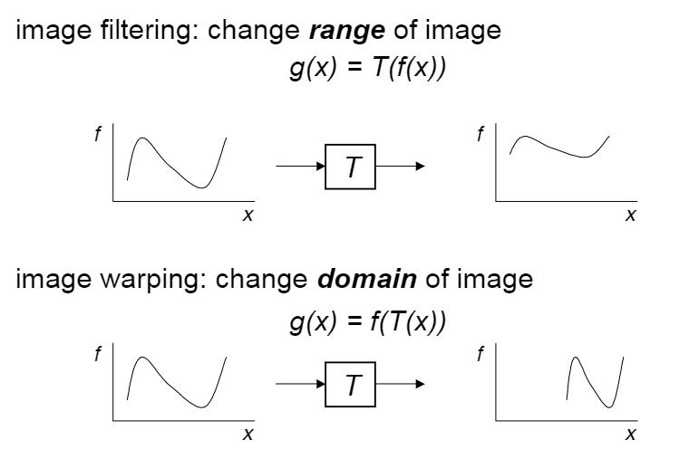

计算机视觉中的warp操作

图像滤波：图像的颜色阈

图像扭曲：图像的空间域

**Parametric Warp** 全局变换矩阵（可分解）

**Forward & Inverse Warping** 

* Mapping
  * Forward
  * Reverse
* Resampling
  * Point sampling
  * Triangle filter
  * Gaussian filter

