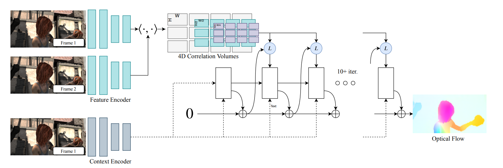
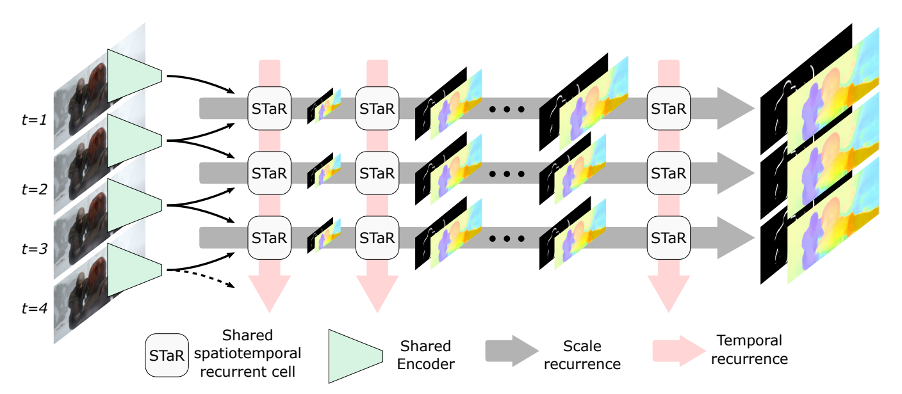
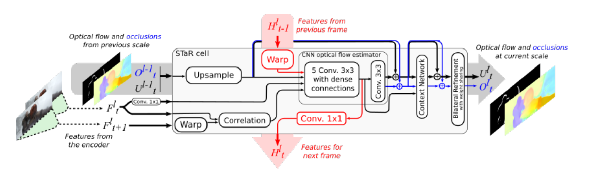

# 多帧光流融合

## 定义
1. 光流(optical flow)

2. 由粗到细(coarse-to-fine)

3. 端到端(end-to-end)

4. 相关代价体(cost correlation volume)

5. 数据集

   

## CNN光流估计

## 多帧光流估计

## Occlusion处理

## Sintel性能对比

### 2. CRAFT

Anonymous. Cross-Attentional Flow Transformer

### 3. GMA

[Github](https://github.com/zacjiang/GMA)

Shihao Jiang, Dylan Campbell, Yao Lu, Hongdong Li, Richard Hartley. Learning to Estimate Hidden Motions with Global Motion Aggregation, ICCV 2021.

### 6. RAFT+NCUP

[Github](https://github.com/abdo-eldesokey/RAFT-NCUP/)

Normalized Convolution Upsampling for Refined Optical Flow Estimation

### 8. MFR

Anonymous. Motion Feature Recovery

### 9. RAFTwarm+AOIR

L. Mehl, C. Beschle, A. Barth, A. Bruhn: An Anisotropic Selection Scheme for Variational Optical Flow Methods with Order-Adaptive Regularisation. SSVM 2021.

### 10. RAFTwarm+OBS

Anonymous. train the RAFT network on new our datasets and applying warmup

### 12. RAFT

Zachary Teed and Jia Deng. RAFT: Recurrent All-Pairs Field Transforms for Optical Flow, ECCV 2020.

### 19. RAFT-A

2-frame result. Deqing Sun, Daniel Vlasic, Charles Herrmann, Varun Jampani, Michael Krainin, Huiwen Chang, Ramin Zabih, William T. Freeman, and Ce Liu. "AutoFlow: Learning a Better Training Set for Optical Flow" CVPR 2021 https://arxiv.org/abs/2104.14544

### 20. RAFT+AOIR

L. Mehl, C. Beschle, A. Barth, A. Bruhn: An Anisotropic Selection Scheme for Variational Optical Flow Methods with Order-Adaptive Regularisation. SSVM 2021.

### 24. DICL-FLOW+

Displacement-Invariant Matching Cost Learning for Accurate Optical Flow Estimation (NeurIPS 2020)

### 25. RAFT-TF_RVC

实现

Deqing Sun, Charles Herrmann, Varun Jampani, Mike Krainin, Forrester Cole, Austin Stone, Rico Jonschkowski, Ramin Zabih, William Freeman, and Ce Liu. A TensorFlow implementation of RAFT (Zachary Teed and Jia Deng. RAFT: Recurrent all-pairs field transforms for optical flow. ECCV 2020.) RVC 2020 submission.

### 27. RAFT+LCV

Taihong Xiao, Jinwei Yuan, Deqing Sun, Qifei Wang, Xin-Yu Zhang, Kehan Xu, Ming-Hsuan Yang. Learnable Cost Volume using the Cayley Representation, ECCV 2020

### 29. DICL_update

Displacement-Invariant Matching Cost Learning for Accurate Optical Flow Estimation (NeurIPS 2020)

### 35. DICL-FLow

和29同一个工作

Displacement-Invariant Matching Cost Learning for Accurate Optical Flow Estimation (NeurIPS 2020)

### 38. STaRFlow (Multi-Frame)

Pierre Godet, Alexandre Boulch, Aurélien Plyer, Guy Le Besnerais. STaRFlow: A SpatioTemporal Recurrent Cell for Lightweight Multi-Frame Optical Flow Estimation, ICPR 2020 (https://arxiv.org/abs/2007.05481)

### 48. MaskFlowNet

Shengyu Zhao, Yilun Sheng, Yue Dong, Eric I-Chao Chang, and Yan Xu. MaskFlownet: Asymmetric Feature Matching with Learnable Occlusion Mask, CVPR 2020 (Oral).

### 49. SMURF (Multi-Frame)

Austin Stone, Daniel Maurer, Alper Ayvaci, Anelia Angelova, Rico Jonschkowski. SMURF: Self-Teaching Multi-Frame Unsupervised RAFT With Full-Image Warping, CVPR 2021

### 52. SelfFlow (Multi-Frame)

Pengpeng Liu, Michael R. Lyu, Irwin King, Jia Xu. SelFlow: Self-Supervised Learning of Optical Flow (CVPR 2019)

### 64. ContinualFlow_ROB(Multi-Frame)

Michal Neoral, Jan Šochman and Jiří Matas. Continual Occlusions and Optical Flow Estimation, ACCV 2018

### 68. MFF (Multi-Frame)

Zhile Ren, Orazio Gallo, Deqing Sun, Ming-Hsuan Yang, Erik B. Sudderth and Jan Kautz: A Fusion Approach for Multi-Frame Optical Flow Estimation. IEEE Winter Conference on Applications of Computer Vision (WACV 2019)

### 69. IRR-PWC (Multi-Frame)

Junhwa Hur and Stefan Roth. Iterative Residual Refinement for Joint Optical Flow and Occlusion Estimation. CVPR 2019

### 81.SAMFL

Zhang Congxuan, Zhou Zhongkai, Chen Zhen, Hu Weming, Li Ming, Jiang Shaofeng. Self-attention-based Multiscale Feature Learning Optical Flow with Occlusion Feature Map Prediction, IEEE Transactions on Multimedia, 2021, DOI: 10.1109/TMM.2021.3096083

### 100. ProFlow(Multi-Frame ??)

D. Maurer, A. Bruhn: ProFlow: Learning to Predict Optical Flow. BMVC 201

## 比较重要的几篇论文即模型结构

###  Sintel 38 **STaRFlow** 2020 ICPR

**Unrolled view of the proposed SpatioTemporal Recurrent architecture for multi-frame OF estimation (STaRFlow).**

**Structure of the proposed SpatioTemporal Recurrent cell (STaR cell).**

### TODO

* IRR

* SelfFlow
* PWC-Fusion(MFF)
* ContinualFLow
* ARFlow-mv(TODO)
* STaRFlow

## 排名性能

### Sintel

* 38 **STaRFlow** 2020 ICPR
* 49 **SMURF** 无监督 2021 CVPR
* 52 **SelfFlow** 自监督 2019 CVPR
* 64 **ContinualFlow_ROB** ACCV 2018
* 68 **MFF** WACV 2019
* 69 **IRR-PWC** CVPR 2019
* 166 **DIP-Flow** BMVC 2018
* 275 **Back2FutureFlow_UFO** 无监督 ECCV 2018

